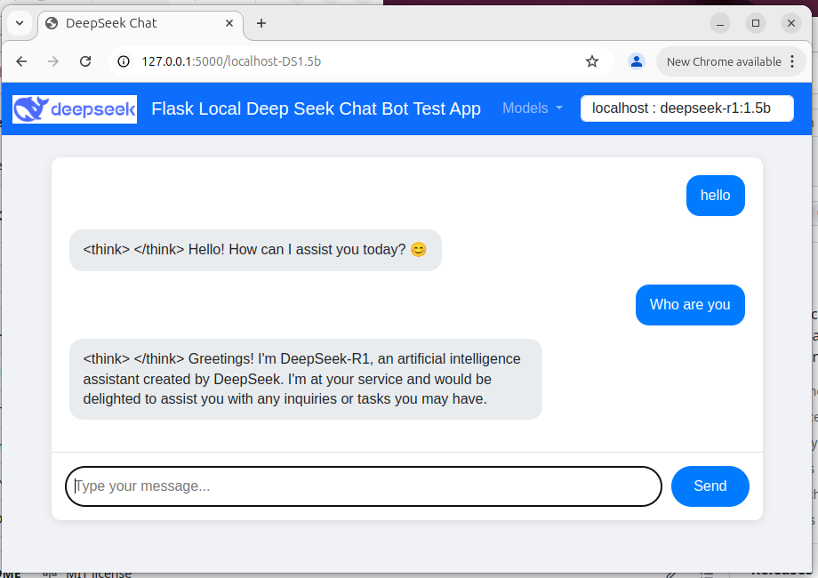
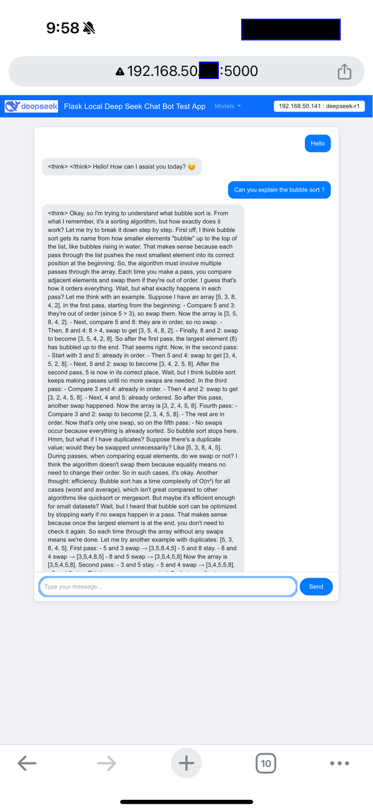
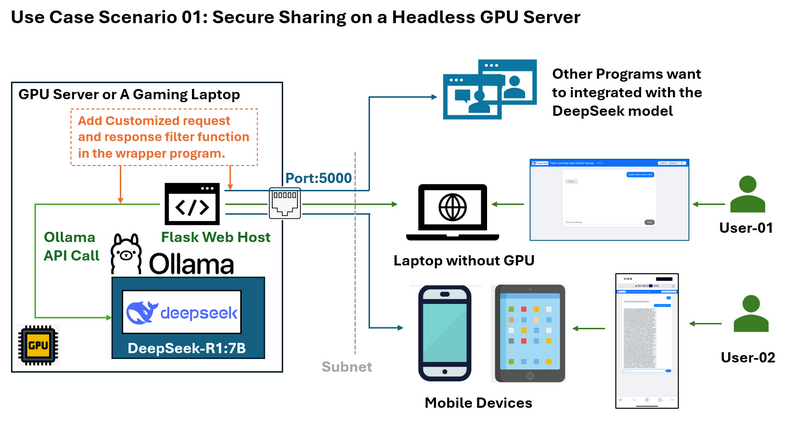
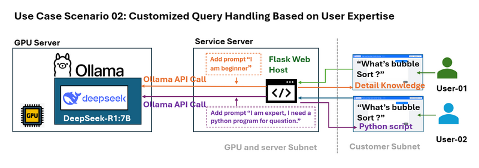
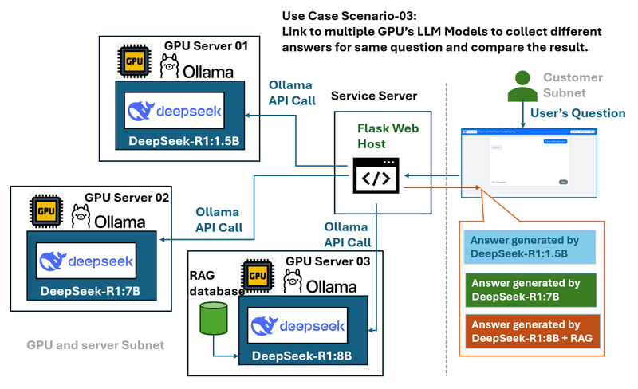

# Use a Simple Web Wrapper to Share the Local Deep Seek-R1 Model Service to LAN Users

In the previous article [Deploying DeepSeek-R1 Locally with a Custom RAG Knowledge Data Base](../1_LocalDeepSeekWithRAG/), we introduced the detail steps about deploying the DeepSeek-R1:7b locally with a customized RAG knowledge database on a desktop with RTX3060. Once the LLM deepseek-r1:7b is running on the local GPU-equipped computer, a new challenge emerges: we can only use the LLM service on the GPU computer, what if we want to use it from other devices in my LAN, is there any way I can access it from a mobile device or share this service with other computer in the same network? By default, Ollama only opens its API to the localhost, meaning that external devices in your LAN cannot easily interact with the model. Changing the configuration to expose the API fully may solve connectivity issues—but it also removes the safeguards that limit potentially risky operations, such as creating complete conversational chains. The user needs a controlled interface that can:

- Limits access to only the necessary functions (e.g., sending questions and receiving responses).
- Provides an intuitive web-based interface for mobile devices.
- Enables programmatic API calls with controlled access.
- Acts as a central hub for connecting to multiple GPU servers and different DeepSeek LLM versions.

```
# Created:     2025/02/28
# version:     v_0.0.1
# Copyright:   Copyright (c) 2025 LiuYuancheng
# License:     MIT License
```

**Table of Contents**

[TOC]

------

### Introduction

This article provides an overview of the Flask wrapper, explores practical use case scenarios, and explains how to configure Ollama to expose the service for LLM API calls. We will explore how a simple Python-Flask-based web wrapper acts as a controlled “bridge” between the local LLM service (deepseek-r1) and LAN users and fulfill below five request:

- Connect multiple local GPU servers running different DeepSeek LLM versions within a subnet.
- Limit or filter the Ollama API access for the LAN user.
- Enable remote testing and performance comparison of LLM responses.
- Provide controlled access to specialized/fine-tuned models without exposing server credentials.
- Facilitate prompt engineering by modifying user queries before model submission.

The use case flow diagram is shown below:


By implementing this web wrapper, users gain secure, controlled access to DeepSeek-R1 models through a user-friendly interface, suitable for both web-based and programmatic interaction. 


------

### Introduction of the DeepSeek Flask Web Wrapper 

This application provides a user-friendly interface for remote access to multiple LLM models running on different GPUs ( using the Ollama host the model). The chatbot is designed for the following purposes:

- Testing the functionality of GPU-hosted Ollama LLM instances.
- Allowing shared access to specialized LLMs (fine-tuned or RAG embedded) without requiring direct SSH access.
- Comparing the performance of different LLM models, such as DeepSeek R1-1.5B and DeepSeek R1-7B, in response to the same query.

The workflow is very simple:

```
User → Web Wrapper (Port 5000) → Ollama API (Port 11434, localhost-only/remote) → Response  
```

The chat bot web UI is shown below :



Users can interact with the chatbot via a web-based UI that includes a model selection dropdown in the navigation bar. The mobile device (phone) view is shown below:



The remote program API function calls (Http `GET` ) is show below:

```python
resp = requests.get("http://127.0.0.1:5000/getResp", json={'model':'localhost-DS1.5b', 'message':"who are you"})
print(resp.content)
```

> Program source repo: https://github.com/LiuYuancheng/Deepseek_Local_LATA/tree/main/Testing/1_Simple_Flask_Deepseek_ChatBot


------

### Expose Ollama Service API in LAN

Using the web wrapper, you can safely expose your Ollama service to LAN users. Instead of directly modifying Ollama’s configuration—which would expose all API functions—the wrapper acts as an intermediary. 

For example, a typical API request via the wrapper might look like this:

```
curl http://localhost:11434/api/generate -d '{ "model": "deepseek-r1:1.5b", "prompt": "Why is the sky blue?"}'
```

This controlled access ensures that while users can send questions and receive answers, but we do not have the ability to modify internal system states or access logs and debugging details and if you use a mobile device such as phone or Ipad which are not easy to create a command line, it will be inconvenient to use the Ollama server. 

To configure the Ollama server for different OS, 

**Setting environment variables on Mac**

If Ollama is run as a macOS application, environment variables should be set using `launchctl`:

1. For each environment variable, call `launchctl setenv`.

```
launchctl setenv OLLAMA_HOST "0.0.0.0:11434"
```

2. Restart Ollama application.

**Setting environment variables on Linux**

If Ollama is run as a systemd service, environment variables should be set using `systemctl`:

1. Edit the systemd service by calling `systemctl edit ollama.service`. This will open an editor.

2. For each environment variable, add a line `Environment` under section `[Service]`:

   ```
   [Service]
   Environment="OLLAMA_HOST=0.0.0.0:11434"
   ```

3. Save and exit.

4. Reload `systemd` and restart Ollama:

   ```
   systemctl daemon-reload
   systemctl restart ollama
   ```


**Setting environment variables on Windows**

On Windows, Ollama inherits your user and system environment variables.

1. First Quit Ollama by clicking on it in the task bar.
2. Start the Settings (Windows 11) or Control Panel (Windows 10) application and search for *environment variables*.
3. Click on *Edit environment variables for your account*.
4. Edit or create a new variable for your user account for `OLLAMA_HOST`, set its value to `0.0.0.0`
5. Click OK/Apply to save.
6. Start the Ollama application from the Windows Start menu.

>  Reference : https://github.com/ollama/ollama/blob/main/docs/faq.md#how-do-i-configure-ollama-server


------

### Use Case Scenarios

#### Use Case Scenario 01: Secure Sharing on a Headless GPU Server

**Problem:**
Imagine you have a GPU server running DeepSeek on an Ubuntu system without a desktop environment. You want to share the LLM service with others on the same subnet without exposing SSH credentials or the full Ollama API functionality.

You want to limited the access such as only allow response without showing deepseek's "thinking" log and you also want to add some customized filter for the user's request and LLM's response.

**The wrapper solution and work flow diagram is shown below:**

The web wrapper allows you to:

- Expose only the necessary API endpoints (e.g., sending questions and receiving answers) on port 5000.
- Prevent direct access to sensitive parts of the Ollama API.
- Provide a clean web interface accessible from any device on the network, including mobile devices.
- Provide a limited http API for the other program running on computer in the same LAN.


#### Use Case Scenario 02: Customized Query Handling Based on User Expertise

**Problem:**
Different users have different levels of expertise. For example, A beginner might need a simplified explanation of an algorithm like bubble sort, whereas an expert might require a detailed technical example.

**The wrapper solution and work flow diagram is shown below:**



The wrapper can intercept user queries and append context-specific prompts before sending the query to the LLM. For example:

- **Beginner Query:** The system modifies “What is bubble sort?” to “I am new beginner to sorting algorithms. What is bubble sort?”
- **Advanced Query:** It transforms the question into “I am an expert and need a Python example. What is bubble sort?”

This dynamic prompt engineering tailors responses to the user’s needs.


#### Use Case Scenario 03: Multi-GPU Server and Model Comparison

**Problem:**
In environments with several GPU servers running various DeepSeek LLM models (such as DeepSeek R1-1.5B, DeepSeek R1-7B, and DeepSeek Coder V2), comparing the performance and responses of these models can be challenging when managed separately.

**The wrapper solution and work flow diagram is shown below:**



The web wrapper serves as a central hub that:

- Connects to multiple local GPU servers.
- Provides a dropdown menu to select different models.
- Allows users to send the same query to multiple models for easy performance and response comparison.
- Offers a controlled and consistent interface regardless of the underlying server.


#### Scenario 4: Load Balancing and Monitoring GPUs

**Problem** :

In a multi-GPU cluster, efficiently managing requests from different users or node IP addresses can be challenging. Without proper request distribution, some GPUs may become overloaded while others remain underutilized. Additionally, logging request data for monitoring and optimization purposes is crucial.

**The wrapper solution** : 

The web wrapper acts as a request management layer, implementing a queue system to log user queries and distribute them efficiently across available GPU servers. By balancing workloads dynamically, it prevents overloading a single GPU while ensuring optimal resource utilization. The request logs can also be stored for analysis, enabling administrators to track usage patterns and improve system performance.


------

### Conclusion

A simple Flask wrapper unlocks powerful use cases for local LLM deployments:

1. **Security**: Limits exposure of Ollama endpoints.
2. **Accessibility**: Provides mobile-friendly interfaces.
3. **Flexibility**: Enables prompt engineering, multi-model testing, and load balancing.

The simple Flask web wrapper is a powerful solution for sharing the DeepSeek-R1 model service with LAN users securely and efficiently. By bridging the gap between the local Ollama API and external devices, the wrapper ensures that the service remains accessible yet controlled. Whether you’re looking to offer a streamlined mobile interface, safeguard sensitive API endpoints, or compare multiple LLM models, this approach addresses common challenges and enhances the usability of local DeepSeek deployments.


------

### Reference  

- https://github.com/ollama/ollama/blob/main/docs/api.md
- https://github.com/ollama/ollama/blob/main/docs/faq.md#how-do-i-configure-ollama-server

------

> last edit by LiuYuancheng (liu_yuan_cheng@hotmail.com) by 08/02/2025 if you have any problem, please send me a message. 