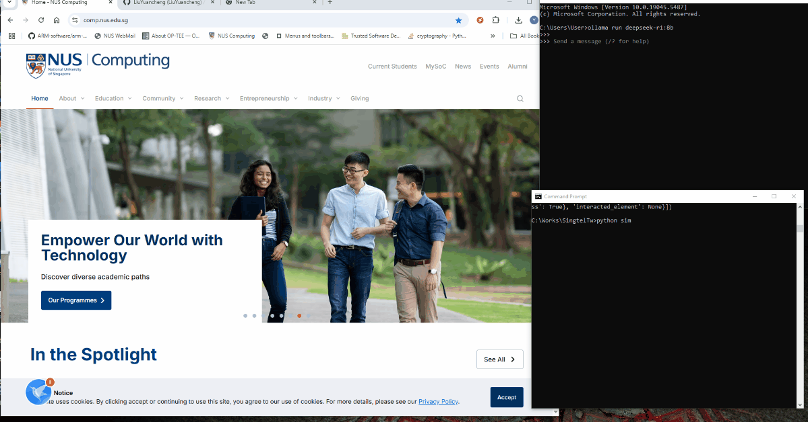
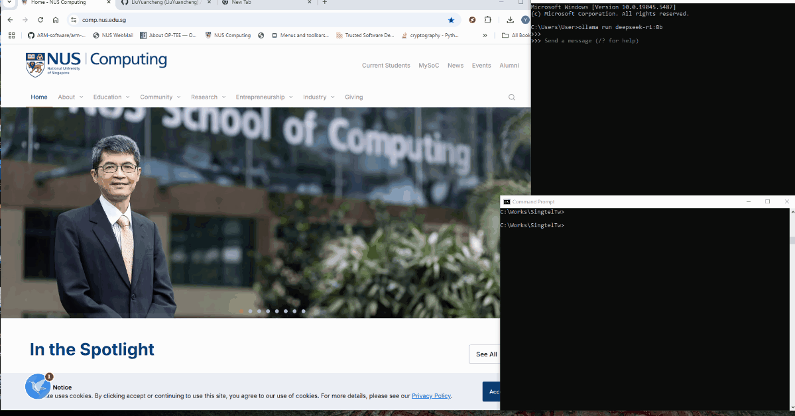
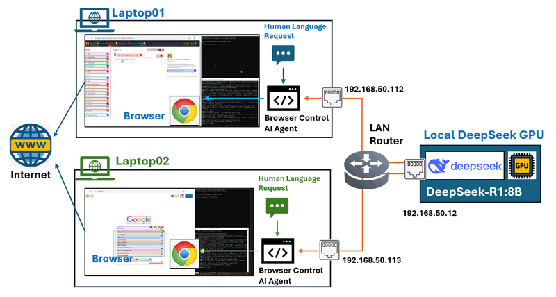

# Creating an MCP Agent with Local/LAN DeepSeek Service for Browser Control

In this article, we explore how to build an AI-driven Model Context Protocol (MCP) Agent that can help user to operate a web browser to complete tasks or generate network traffic based on human language instructions. This is achieved using the powerful [browser-use](https://github.com/browser-use/browser-use) library in combination with a Local/LAN configured DeepSeek LLM module service.

We will Introduce step by step through setting up the **Ollama DeepSeek service** in a local LAN environment, integrating it with the MCP Agent, and integrate with browser automation. Since the DeepSeek model runs locally, you won't have to worry about the "deepseek service busy" issues and token fees. Additionally, this setup allows for testing various models or including customized fine-tuned DeepSeek versions to compare the performance of different models.

This article will cover the following sections:

- **Agent Test Scenario Introduction** – Overview of use cases with the demo.
- **Agent Operation Detailed Design** – Technical introduction of how the MCP Agent interacts with the browser.
- **Test Environment Setup** – Configuring the local DeepSeek service and browser interaction module.
- **Test Result Summary and Conclusion** – Evaluating performance, insights, and potential improvements.

```
# Created:     2025/03/08
# version:     v_0.0.1
# Copyright:   Copyright (c) 2025 LiuYuancheng
# License:     MIT License
```

**Table of Contents**

[TOC]

------

### Agent Task Scenarios

To demonstrate the capabilities of the MCP Agent, we evaluate its performance through two task scenarios. In each case, the agent receives a human language input string and autonomously interacts with a web browser to retrieve and summarize relevant information. The final output is a concise text summary file.

#### Scenario 1: General Information Search & Summarization

In this scenario, the agent performs a **web search**, gathers relevant content, and generates a structured summary.

Human Language Input string:

```
Google search DeepSeek and summarize the product features in 500 words. 
```

**Agent Operation:** The agent initiates a search query, extracts key details from multiple sources, and compiles a summary. The demo video is shown below:




#### Scenario 2: Targeted Web Content Extraction & Summarization

Here, the agent is tasked with visiting a specific website or project repository, extracting critical details (e.g., a README file), and summarizing the content.

Human Language Input string:

```
Find the project “Deepseek_Local_LATA,” open the README file, and summarize the project in 100 words.
```

**Agent Operation:** The agent locates the repository, extracts the README content, and generates a concise summary.The demo video is shown below:

These scenarios showcase how the MCP Agent can autonomously navigate the web, retrieve relevant information, and provide structured summaries—all powered by **local/LAN DeepSeek AI processing** for efficiency and control.


------

### Agent Operation Detailed Design

Before we introduce the detailed design, we will introduce the background knowledge about the Model Context Protocol (MCP):The **Model Context Protocol (MCP)** is an open standard that facilitates secure and standardized connections between AI assistants and various data sources. MCP enables Large Language Models (LLMs) to access tools and datasets directly, enhancing their ability to retrieve information and execute tasks effectively. In the MCP architecture, **MCP Servers** are lightweight programs that expose specific capabilities through the standardized protocol. The MCP service is the imtermedite level program running between the tool or application and the LLM service 

These service includes several agents program provide tools, resources, and prompt templates that clients can discover and utilize, enabling rich interactions between clients and language models. In this article, we will create a simple MCP agent which can interact with the browser, the work flow is shown below:


By managing resources with URI-based access patterns and supporting capability negotiation, MCP Servers play a crucial role in extending the functionalities of AI systems, allowing them to perform actions or retrieve information securely and efficiently. 


------


### Environment Introduction

Assume we have 2 or more machines in a LAN, one GPU computer and multiple normal Laptop. Now we want to create an AI Agent which can help control the browser on the Laptop and the GPU computer. The network topology is shown below:



To setup the environment we need to setup Deepseek service on the GPU server and open for the other LAN nodes. Then we install the agent on the operating Laptops. Configuration:

| VM name          | IP address     | Program                 | Human Language Requests                                      |
| ---------------- | -------------- | ----------------------- | ------------------------------------------------------------ |
| Local GPU server | 192.168.50.12  | Ollama [deepseek-r1:8b] | N.A                                                          |
| Laptop01         | 192.168.50.112 | Browser Control Agent   | Google search deepseek and summarize the product features in 500 words. |
| Laptop02         | 192.168.50.113 | Browser Control Agent   | Find the project “**[Deepseek_Local_LATA](https://github.com/LiuYuancheng/Deepseek_Local_LATA)**” and open the readme file, summarize the project in 100 words. |


