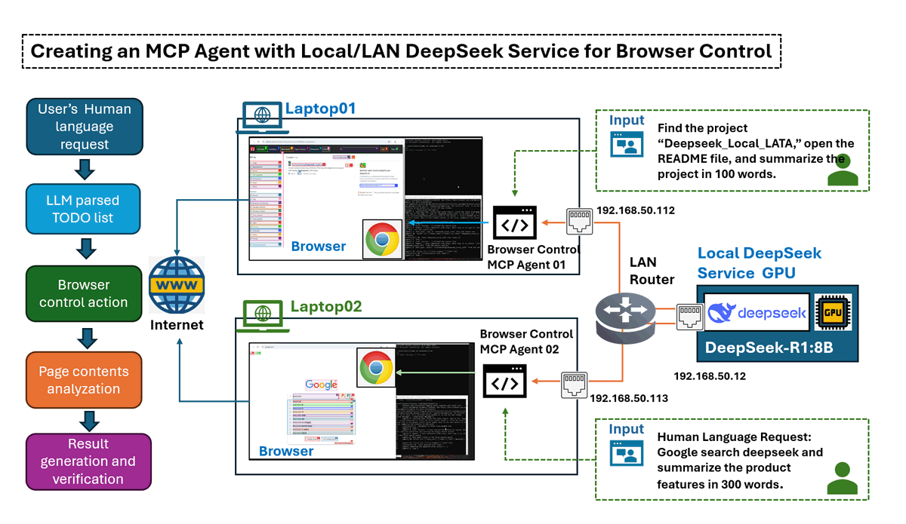
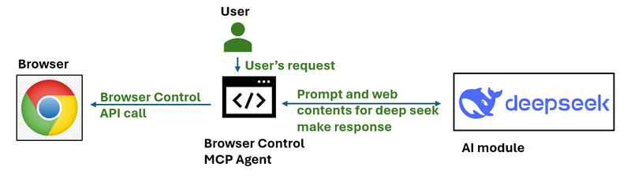
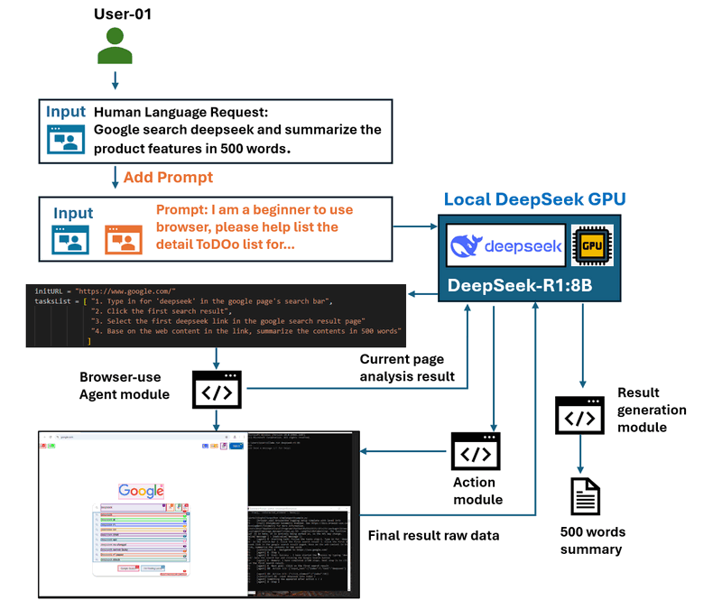

# Creating an MCP Agent with Local/LAN DeepSeek Service for Browser Control

In this article, we explore how to build an AI-driven Model Context Protocol (MCP) Agent that can help user to operate a web browser to complete tasks or generate network traffic based on human language instructions. This is achieved using the powerful [browser-use](https://github.com/browser-use/browser-use) library in combination with a Local/LAN configured DeepSeek LLM module service.

We will Introduce step by step through setting up the **Ollama DeepSeek-R1 Service** in a local LAN environment, link it with the MCP Agent, and integrate with browser automation. Since the DeepSeek model runs locally, you won't have to worry about the "deepseek service busy" issues and the token fees. Additionally, this setup allows for testing various models or including customized fine-tuned DeepSeek versions to compare the performance of different models.

This article will cover the following sections:

- **Agent Test Scenario Introduction** – Overview of use cases with the demo.
- **Agent Operation Detailed Design** – Technical introduction of how the MCP Agent interacts with the browser.
- **Test Environment Setup** – Configuring the local DeepSeek service and browser interaction module.
- **Test Result Summary and Conclusion** – Evaluating performance, insights, and potential improvements.

```
# Created:     2025/03/08
# version:     v_0.0.1
# Copyright:   Copyright (c) 2025 LiuYuancheng
# License:     MIT License
```

**Table of Contents**

[TOC]

- [Creating an MCP Agent with Local/LAN DeepSeek Service for Browser Control](#creating-an-mcp-agent-with-local-lan-deepseek-service-for-browser-control)
    + [MCP Agent Task Scenarios](#mcp-agent-task-scenarios)
      - [Scenario 1: General Information Search & Summarization](#scenario-1--general-information-search---summarization)
      - [Scenario 2: Targeted Web Content Extraction & Summarization](#scenario-2--targeted-web-content-extraction---summarization)
    + [MCP Agent Operation Detailed Design](#mcp-agent-operation-detailed-design)
      - [Background: Model Context Protocol (MCP)](#background--model-context-protocol--mcp-)
      - [Agent Workflow Overview](#agent-workflow-overview)
        * [Step 1: Add Scenario Prompt & Generate a To-Do List](#step-1--add-scenario-prompt---generate-a-to-do-list)
        * [Step 2: Agent Interact with the Host's Browser](#step-2--agent-interact-with-the-host-s-browser)
    + [Environment Introduction and Setup](#environment-introduction-and-setup)
      - [Environment Over View](#environment-over-view)
      - [Setting Up the DeepSeek Service on the GPU Node](#setting-up-the-deepseek-service-on-the-gpu-node)
        * [Step 1 : Install Ollama LLM Service](#step-1---install-ollama-llm-service)
        * [Step 2 Download and Run DeepSeek-R](#step-2-download-and-run-deepseek-r)
        * [Step 3: Expose DeepSeek Service to LAN](#step-3--expose-deepseek-service-to-lan)
      - [Configure the Agent on Operation Node](#configure-the-agent-on-operation-node)
        * [Step 1 : Install Required Python Libraries](#step-1---install-required-python-libraries)
        * [Step 2: Configure Agent Parameters](#step-2--configure-agent-parameters)
        * [Step 3: Run the MCP Agent](#step-3--run-the-mcp-agent)
    + [Test Result Summary and Conclusion](#test-result-summary-and-conclusion)

------

### MCP Agent Task Scenarios

To demonstrate the capabilities of the MCP Agent, we evaluate its performance through two task scenarios. In each case, the agent receives a human language input string and autonomously interacts with a web browser to retrieve and summarize relevant information. The final output is a concise text summary file.

#### Scenario 1: General Information Search & Summarization

In this scenario, the agent performs a **web search**, gathers relevant content, and generates a structured summary.

Human Language Input string:

```
Use google search 'deepseek', go to its web and summarize the web contents in 300 words.
```

**Agent Operation:** The agent initiates a search query, extracts key details from multiple sources, and compiles a summary. The demo video is shown below:


`Figure-01: Scenario 1: General Information Search & Summarization record, version v_0.0.1 (2025)`

#### Scenario 2: Targeted Web Content Extraction & Summarization

Here, the agent is tasked with visiting a specific website or project repository, extracting critical details (e.g., a README file), and summarizing the content.

Human Language Input string:

```
Find the project “Deepseek_Local_LATA,” open the README file, and summarize the project in 100 words.
```

**Agent Operation:** The agent locates the repository, extracts the README content, and generates a concise summary. The demo video is shown below:


`Figure-02: Scenario 2: Targeted Web Content Extraction & Summarization record, version v_0.0.1 (2025)`

These scenarios showcase how the MCP Agent can autonomously navigate the web, retrieve relevant information, and provide structured summaries—all powered by a **local/LAN DeepSeek AI processing** for efficiency and control.


------

### MCP Agent Operation Detailed Design

Before diving into the agent’s detailed design, let's first introduce some background knowledge about the  **Model Context Protocol (MCP)**. MCP is an open standard that enables secure and standardized connections between AI assistants and various data sources. It allows Large Language Models (LLMs) to access tools and datasets directly, improving their ability to retrieve and process information.

#### Background: Model Context Protocol (MCP)

In an MCP architecture, **MCP Servers** act as lightweight programs that expose specific functionalities through the standardized protocol. The **MCP Service** serves as an intermediary layer, bridging applications or tools with the LLM service. These services include various **MCP Agents**, each providing tools, resources, and prompt templates that enable dynamic interactions between AI systems and clients.

For this project, we develop a simple **MCP Agent** that interacts with a web browser. The **workflow** of this agent is shown below:



`Figure-03: simple workflow diagram of browser control MCP agent, version v_0.0.1 (2025)`

By managing resources with URI-based access patterns and supporting capability negotiation, MCP Servers play a crucial role in extending the functionalities of AI systems, allowing them to perform actions or retrieve information securely and efficiently.

#### Agent Workflow Overview

The agent workflow is very simple as shown below and it operates in three primary steps:

- Step 1: Add Scenario Prompt & Generate a To-Do List.
- Step 2: Interact with the Browser and analyze the page contents.
- Step 3: Generate the Final Summary/Result and verify tasks finished.



`Figure-04: detailed workflow diagram of browser control MCP agent, version v_0.0.1 (2025)`

##### Step 1: Add Scenario Prompt & Generate a To-Do List

The agent begins by modifying the user’s input request into a structured **To-Do list**. This step ensures that the agent understands how to systematically execute the requested task. Below is an example prompt we append before the user's request:

```
Prompt: I am an AI agent program can simulate human actions as a beginner user to use browser, please create the TO-DO steps need to be simulated for the task:
```

When the user input string `Google search DeepSeek and summarize the product features in 300 words`, the request agent send to AI will be modified to below contents : 

```
# Input to deepseekR1:8b model
Prompt: I am an AI agent program can simulate human actions as a beginner user to use browser, please create the TO-DO steps need to be simulated for the task: Using Google search to find DeepSeek and summarize its product features in 300 words. 

The output should exactly follow the JSON format below:
{
    "initURL":"<First URL for browser to open>",
    "tasksList":[
        "1. <Step 1 - Perform an action>",
        "2. <Step 2 - Process results based on previous step>",
        "3. <Step 3 - Perform next action>",
        "4. <Step 4 - Process results based on previous step>",
        ...
    ]
}
```

Then we send the request to the Deepseek to get below ToDo list:

```
# Output from deepseekR1:8b model
initURL = "https://www.google.com/"
tasksList = [ 
	"1. Type in for 'deepseek' in the Google page's search bar",
	"2. Click the first search result",
	"3. Select the first deepseek link in the google search result page"
	"4. Base on the web content in the link, summarize the contents in 300 words"
]
```


##### Step 2: Agent Interact with the Host's Browser

Once the **To-Do list** is generated, the agent executes the steps autonomously using the Playwright library and browser-use interaction module:

1. Open the initial URL given by deepseek-r1:8b model (Google search page).
2. Perform sequential actions from the To-Do list (e.g., typing, clicking, navigating).
3. Analyze the current webpage’s content using browser-use and decide whether it satisfies the step requirements.
4. Continue to the next step until all tasks are completed.

Each step is evaluated against real-time webpage analysis to ensure accurate execution. If a step cannot be completed, the agent attempts corrective measures or logs an error.

Reference: 

- Playwright : https://github.com/microsoft/playwright
- Browser-Use: https://github.com/browser-use/browser-use


**Step3: Generate the Result Summary**

Once all tasks in the To-Do list are completed, the extracted content is sent to DeepSeek LLM for summarization. The Final Verification Prompt Sent to LLM:

```
The result content is: <Extracted text>. 

Can this content fulfill the user's goal to Google search DeepSeek and summarize its product features in 300 words? 
```

The final output consists of:

- The extracted content summary.
- DeepSeek’s verification of result accuracy.
- Archived test results for further evaluation.


This agent can be further expanded to support different cloud or local AI models, customized browsing automation, and multi-step reasoning tasks based on user-defined scenarios.


------

### Environment Introduction and Setup

#### Environment Over View

In this test environment setup, we configured a **Local Area Network (LAN)** with at least two types of machines:

- **A GPU-powered server** hosting the DeepSeek service.

- **Multiple standard laptops** running browser control agents.

The AI agent will be responsible for **controlling browsers** on the laptops, and the network topology is illustrated below:


`Figure-05: Test environment network connection configuration, version v_0.0.1 (2025)`

To establish this environment, we need to do the following setup and the configuration is shown below :

- Deploy the DeepSeek service on the GPU server.
- Install and configure browser control agents on the laptops.

| VM name          | IP address     | Hardware spec                 | OS          | Program                 | Human Language Requests                                      |
| ---------------- | -------------- | ----------------------------- | ----------- | ----------------------- | ------------------------------------------------------------ |
| Local GPU server | 192.168.50.12  | Intel-i5, 32GB, RTX-3060      | Windows- 11 | Ollama [deepseek-r1:8b] | N.A                                                          |
| Laptop01         | 192.168.50.112 | Intel-i5, 16GB, RTX-1060      | Windows- 11 | Browser Control Agent   | Google search deepseek and summarize the product features in 300 words. |
| Laptop02         | 192.168.50.113 | Intel-i5, 16GB, Intel UHD GPU | Windows- 11 | Browser Control Agent   | Find the project "Deepseek_Local_LATA" and open the readme file, summarize the project in 100 words. |


#### Setting Up the DeepSeek Service on the GPU Node

The GPU server needs to run DeepSeek-R using Ollama and expose the service connection to LAN nodes.

##### Step 1 : Install Ollama LLM Service

Download **Ollama** from the official site: https://ollama.com/download and select the appropriate package for your OS and install it.

##### Step 2 Download and Run DeepSeek-R

Since our GPU server has an RTX 3060 (12GB), we use the 8B model. Run the following command to download and launch DeepSeek-R1:8b model :

```
ollama run deepseek-r1:8b
```

To check the biggest deepseek model your GPU node can run, you can refer to this link: https://www.linkedin.com/pulse/deploying-deepseek-r1-locally-custom-rag-knowledge-data-yuancheng-liu-uzxwc

##### Step 3: Expose DeepSeek Service to LAN

**Setting environment variables on Mac**

If Ollama is run as a macOS application, environment variables should be set using `launchctl`:

1. For each environment variable, call `launchctl setenv`.

```
launchctl setenv OLLAMA_HOST "0.0.0.0:11434"
```

2. Restart Ollama application.

**Setting environment variables on Linux**

If Ollama is run as a systemd service, environment variables should be set using `systemctl`:

1. Edit the systemd service by calling `systemctl edit ollama.service`. This will open an editor.

2. For each environment variable, add a line `Environment` under section `[Service]`:

   ```
   [Service]
   Environment="OLLAMA_HOST=0.0.0.0:11434"
   ```

3. Save and exit.

4. Reload `systemd` and restart Ollama:

   ```
   systemctl daemon-reload
   systemctl restart ollama
   ```


**Setting environment variables on Windows**

On Windows, Ollama inherits your user and system environment variables.

1. First Quit Ollama by clicking on it in the task bar.
2. Start the Settings (Windows 11) or Control Panel (Windows 10) application and search for *environment variables*.
3. Click on *Edit environment variables for your account*.
4. Edit or create a new variable for your user account for `OLLAMA_HOST`, set its value to `0.0.0.0`
5. Click OK/Apply to save.
6. Start the Ollama application from the Windows Start menu.

>  Reference : https://github.com/ollama/ollama/blob/main/docs/faq.md#how-do-i-configure-ollama-server


#### Configure the Agent on Operation Node

Node the GPU node is ready, we need to configure each operation node laptop. The operation node requires: A modern web browser , Python 3.11 or higher, Required and Python libraries installed.

##### Step 1 : Install Required Python Libraries

Install Ollama and LangChain support:

```bash
pip install ollama
pip install langchain-ollama
```

Install the **browser-use** automation library:

```bash
pip install browser-use
```

Install **Playwright** for browser control:

```bash
playwright install
```

##### Step 2: Configure Agent Parameters

Each laptop runs a browser control agent that interacts with DeepSeek, download the file `dsBrowserCtrlAgent.py` , `dsBrowserCtrlConfig.txt` and `ConfigLoader.py` to the operation node. 

Set up the deepseek service configuration  `dsBrowserCtrlConfig.txt` based on the GPU node and the model running:

```python
# This is the config file template for the module <dsBrowserCtrlAgent.py>
# Setup the parameters with below format (every line follow <key>:<val> format, the
# key can not be changed):
#-----------------------------------------------------------------------------
# GPU node IP address which provide the ollama service.
OLLAMA_HOST_IP:192.168.50.12
#-----------------------------------------------------------------------------
# The deepseek model name we want to use.
DP_MODEL_NAME:deepseek-r1:8b
#-----------------------------------------------------------------------------
# The deepseek CTX number name we want to use, # for deepseek-r1:7b and 8b use 
# 6000, for higher model use 32000
NUM_CTX:6000
```

Then add the request to the `USER_REQUEST` parameter as shown below then start:

```python
#-----------------------------------------------------------------------------
# the user request string such as Use google search 'deepseek', go to its web 
# and summarize the web contents in 100 words
USER_REQUEST:Use google search 'deepseek', go to its web and summarize the web contents in 100 words
```


##### Step 3: Run the MCP Agent

Then execute the agent with below command and collect the result.

```
python dsBrowserCtrlAgent.py
```

The agent will Connect to the GPU server which running DeepSeek-R1, perform browser interactions (e.g., searching, clicking, summarizing) and return the processed output based on the request.

Code link: https://github.com/LiuYuancheng/Deepseek_Local_LATA/tree/main/Application/BrowserAgent

------

### Test Result Summary and Conclusion

During the evaluation, we tested four different DeepSeek model sizes to analyze their impact on task completion  and execution speed. The test involved executing a series of browser-based tasks, including searching for a specific project, selecting relevant links, reading content, and summarizing information.

Below is a tasks result of the scenario 2: 

| Function \ Deepseek model                                    | deepseek-r1:1.5b | deepseek-r1:7b | deepseek-r1:8b | deepseek-r1:14b |
| ------------------------------------------------------------ | ---------------- | -------------- | -------------- | --------------- |
| Generate Todo List                                           | Finished         | Finished       | Finished       | Finished        |
| 1. Click the search icon(magnifier) at the top of the page.  | Finished         | Finished       | Finished       | Finished        |
| 2. Type in 'Deepseek_Local_LATA' in th search bar.           | Failed           | Finished       | Finished       | Finished        |
| 3. Select the link Deepseek_Local_LATA in the result         | Failed           | Finished       | Finished       | Finished        |
| 4. Select README.md file link and scroll down                | Failed           | Failed         | Finished       | Finished        |
| 5. Base on the readme content in the link, summarize the contents in 100 words | Failed           | Failed         | Finished       | Finished        |

During the test, there are some observation: 

- **Basic Task Completion**: All models, including the smallest (1.5B), successfully performed simple actions such as generating a to-do list and clicking the search icon.
- **Search and Navigation**: Models below 7B struggled with executing keyword searches and selecting relevant links.
- **Content Processing**: A minimum of 8B was required to read and summarize a README file effectively.
- **Performance Scaling**: The **14B model** demonstrated superior performance, completing all tasks without failure and ensuring better execution speed and accuracy.

**Conclusion** : 

The test results highlight that model size significantly impacts task success rate and execution efficiency. The **8B model** is the minimum viable option for basic browsing tasks, while the bigger than 14B model is recommended for handling more complex, multi-step processes with higher accuracy and reliability.

This design ensures a structured, automated, and accurate approach to executing browser-based tasks using an MCP-powered AI agent. By integrating local DeepSeek LLM processing, users benefit from:

- **Lower latency** compared to cloud-based solutions.
- **Cost efficiency** by eliminating dependency on external APIs.
- **Customization flexibility** for tailored AI-driven automation.

For users seeking **higher accuracy and robust execution**, investing in **larger DeepSeek models (14B and above)** is recommended to maximize performance and reliability in AI-driven browser task automation.

------

> last edit by LiuYuancheng (liu_yuan_cheng@hotmail.com) by 18/03/2025 if you have any problem, please send me a message. 