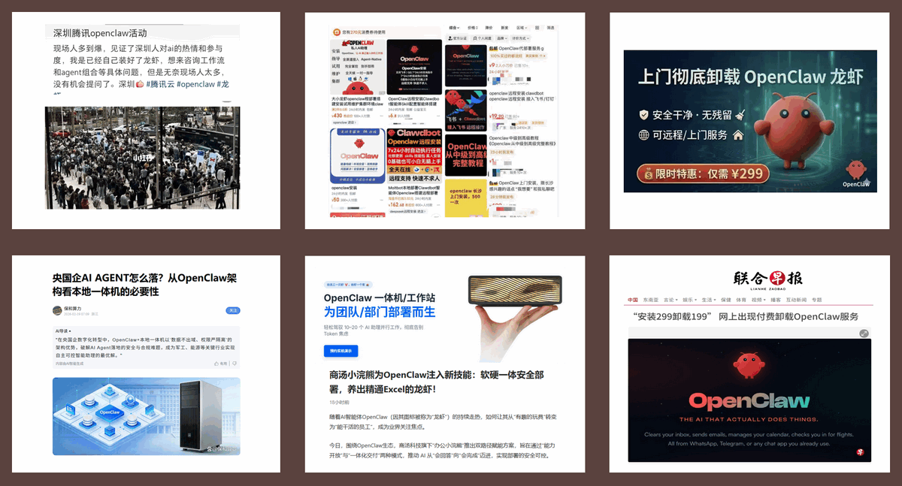
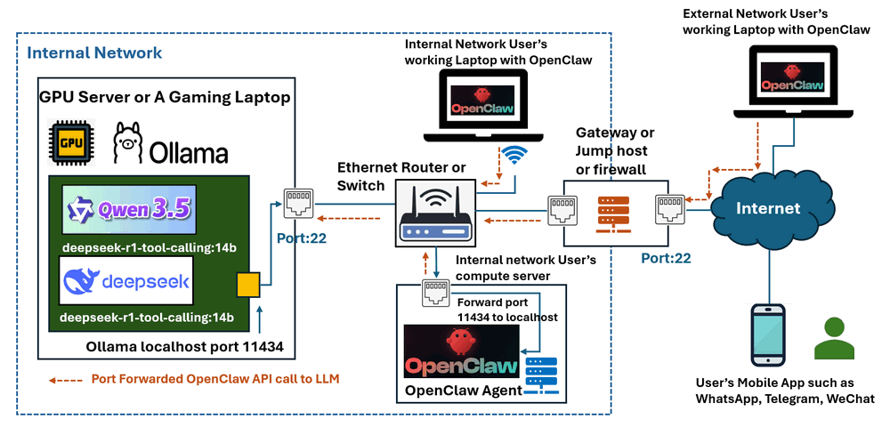
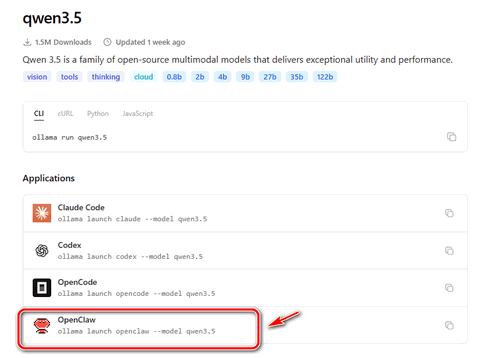
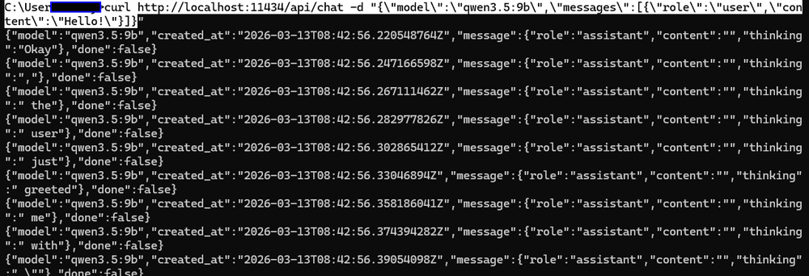

# Deploy Multiple OpenClaw AI Assistant Cluster With Local GPU Running Qwen3.5 or DeepSeek-r1

**Project Design Purpose** : In this article, I will share the design and deployment of a distributed multiple OpenClaw AI assistants cluster connected to locally hosted Large Language Models (LLMs) running on a GPU-enabled server or gaming laptop.  Instead of relying on cloud-based AI APIs. I used the open-source models such as `Qwen 3.5` or `DeepSeek-R1` to provide inference services for multiple OpenClaw agents, so we can reduces cloud AI token costs and compare the performance of different LLM model.

In this AI Assistant Cluster System, the GPU server acts as the centralized AI reasoning engine, and the distributed agents (computers run OpenClaw communicate with the LLM server over the network) execute tasks, collect system information, and interact with the model for decision-making. This article covers the following three sections:

- Setting up the open-source LLM model on a GPU server or gaming laptop/computer.
- Configuring and exposing the LLM inference service so that it can be accessed by remote OpenClaw nodes.
- Deploying OpenClaw agents on target computers or laptops and connecting them to the centralized LLM service

```python
# Author:      Yuancheng Liu
# Created:     2026/03/10
# Version:     v_0.0.2
# Copyright:   Copyright (c) 2026 LiuYuancheng
# License:     MIT License
```

 **Table of Contents**

[TOC]

------

### 1. Introduction

In this project, the OpenClaw cluster design separates LLM inference services from agent execution nodes. A GPU-enabled server or gaming laptop inside the internal network hosts the LLM models through Ollama, which provides a lightweight local API service for running open-source models. Multiple computers or laptops running OpenClaw agents connect to this centralized LLM service to perform reasoning and task execution.

#### 1.1 Abstract and Background 

Over the past month, the personal AI assistant [OpenClaw](https://openclaw.ai/) has rapidly become one of the most discussed open-source AI projects. Its rapid rise in popularity has led to a wave of new services and businesses around the ecosystem. For example in China, many individuals and organizations now offer installation services, remote deployment support, and children training courses on how to use OpenClaw effectively. Some companies even market “all-in-one OpenClaw machines/Laptop” preinstalled with OpenClaw and local large language models. And the major technology companies such as **Tencent** have also begun offering related OpenClaw deployment services: 



One of the key reasons behind the rapid adoption of OpenClaw is its "skills" based architecture, which enables the agent to call multiple tools and reasoning steps dynamically when executing tasks. While this design significantly enhances the intelligence and automation capability of the AI assistant, it also dramatically increases the number of LLM API calls. As a result, token consumption can be tens or even hundreds of times higher than that of traditional single-prompt AI agents. If you don't need to do complex tasks and have a GPU server or station such as Nvidia GB10 Spark or a gaming laptop with RTX-series 50XX graphics cards, you can link your OpenClaw to the open source LLM like **Qwen 3.5** or **DeepSeek‑R1** running on these local machine to save the costs especially when you have several OpenClaw Agents running on different device.


#### 1.2 System Architecture

The overall system follows a distributed agent + centralized inference architecture as shown below diagram. so it allows a single GPU server to support **multiple OpenClaw agents simultaneously**, forming a lightweight **AI agent cluster** while keeping hardware and cloud costs low.



The Architecture includes four layers:

- **LLM Host Layer** :  A GPU server or AI/gaming laptop hosts open-source LLM models through Ollama.
- **Network Access Layer** : Secure access is provided via SSH port forwarding through routers, gateways, or jump hosts.
- **Agent Layer** : Multiple OpenClaw agents run on user laptops or computers and send LLM requests through the forwarded port.
- **User Interaction Layer** : Users interact with the agents through their local system or messaging platforms such as mobile applications.

To improve security and avoid directly exposing the LLM service to the public network, the architecture uses SSH port forwarding. The Ollama inference service runs locally on port 11434, and this port is forwarded securely to authorized OpenClaw nodes through SSH (port 22). So with this approach:

- The LLM API is not exposed directly to the network.
- Only authenticated users with valid SSH accounts can access the model service
- External users can connect through a gateway, router, or jump host
- Access control can be easily managed by enabling or disabling user accounts on the GPU server


------

### 2. Setting Up the OpenClaw Compatible Open-source LLM on GPU

All the setups in this section need to do on the GPU server.

First we need to setup the OpenClaw Compatible LLM on your GPU server. We can easilty use the Ollama to setup the LLM on your server. 

To download all install the Ollama, you can go to the download page https://ollama.com/download/linux and follow installation command based on your OS type.

Once the install finished we need to check what kinds of opensource LLM model the openclaw can use, below is the table:

| **Model Name**       | **Parameter Size** | **Best Use Case**                        | **Context Window** | **Recommended Hardware**            |
| -------------------- | ------------------ | ---------------------------------------- | ------------------ | ----------------------------------- |
| **GLM-5**            | 744B (MoE)         | Complex debugging & multi-step coding    | 200K               | Enterprise (A100/H100) or Cloud API |
| **GPT-OSS-120B**     | 120B               | High-stakes reasoning & data privacy     | 128K               | Dual RTX 6000 / Mac Studio (Ultra)  |
| **DeepSeek-V3.2**    | 671B (MoE)         | General-purpose high-speed agentic tasks | 128K               | Cloud API / Multi-GPU Server        |
| **Kimi-K2.5**        | 1T (MoE)           | Vision + Text (multimodal agent tasks)   | 1M                 | Cloud API / 8x H100                 |
| **Qwen 3.5 (32B)**   | 32B                | Best balance for high-end consumer GPUs  | 128K               | RTX 4090 (24GB VRAM)                |
| **Llama 4 Maverick** | 70B                | Reliable daily assistant & tool calling  | 128K               | Mac Studio / Multi-RTX 3090         |
| **Qwen 3.5 (14B)**   | 14B                | Entry-level local agent tasks            | 64K                | RTX 3060/4070 (12GB+ VRAM)          |
| **MiMo-V2-Flash**    | ~30B (Active)      | Ultra-fast "thinking" & long research    | 256K               | RTX 4080/4090                       |

You can also check in the Ollama's model download page to check the "Application" tag to see whether the module is available for using by the OpenClaw as shown below:



Now we can pull the related model in the GPU server, as I use RTX3060 and A5000, so I use the Qwen3.5-35B-A3B-FP8 and deepseek-r1-tool-calling:14b. 

Pull the Qwen3.5-35B-A3B-FP8

```
ollama pull qwen3.5:35b
ollama run qwen3.5:35b
```

Pull the deepseek-r1-tool-calling:14b model:

```
ollama pull MFDoom/deepseek-r1-tool-calling:14b
ollama run deepseek-r1-tool-calling:14b
```

After install success,The Ollama service should be running in the background. You can verify it by running `ollama serve` in a terminal or using the desktop application. 

When ollama API is called, the model will be auto loaded and use, on Linux machine you can also create a service to make the model always running so the 1st API call will be fast:

```python
[Unit]
Description=DeepSeek14B_service
After=network.target
[Service]
ExecStart=ollama run qwen3.5:35b
WorkingDirectory=/home/<username>/ollama
User=root
Restart=always
RestartSec=5
StandardOutput=null
StandardError=null
[Install]
WantedBy=multi-user.target
```


------

### 3. Forward the Ollama LLM Service to the User

All the setups in this section need to do on the GPU server.

After the ollama setup, you can can create a user which only used for forwarding the traffic, assume the user I create is `llmService`, Now in the computer or laptop you want to setup the openClaw you need to run the port forward command, if the computer and your GPU host are in the same subnet,

```bash
ssh -L localhost:11434:localhost:11434 llmService@<GPU_Server_Ip_Address>
```

Now we need to test weather you can use the ollama service normally with the curl command: 

```bash
curl http://localhost:11434/api/chat -d "{\"model\":\"qwen3.5:9b\",\"messages\":[{\"role\":\"user\",\"content\":\"Hello!\"}]}"
```

or Win PowerShell:

```powershell
curl.exe http://localhost:11434/api/chat -d '{"model":"qwen3.5:9b","messages":[{"role":"user","content":"Hello!"}]}'
```

If there is some repose show up, which means your computer can use the GPU LLM service correctly:



If you want to connect from the internet or subnet outside the network GPU in with as jump host, on the 


curl http://localhost:11434/api/chat  -d '{"model":"qwen3.5:9b","messages":[{"role":"user","content":"Hello!"}]}'


https://blog.csdn.net/u010026928/article/details/158582591

https://www.nvidia.com/en-sg/products/workstations/dgx-spark/

https://news.hubeidaily.net/pc/c_5240661.html

https://www.pingwest.com/w/311980

https://xueqiu.com/5680323216/377215813

https://www.bilibili.com/video/BV1vdwczDEoR/?spm_id_from=333.1007.tianma.2-1-4.click&vd_source=5ff50dfdd1613df97004d3548592e433

