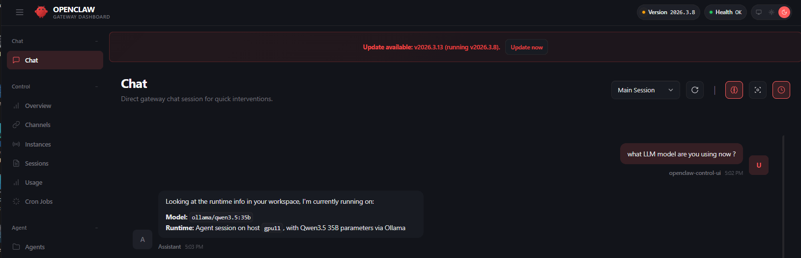
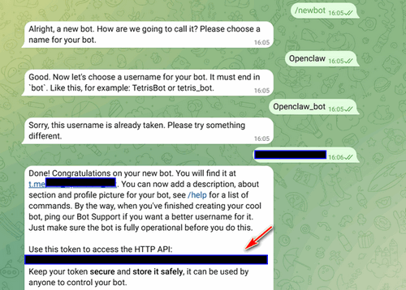
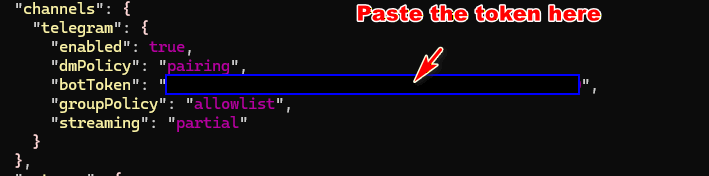
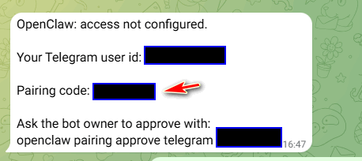
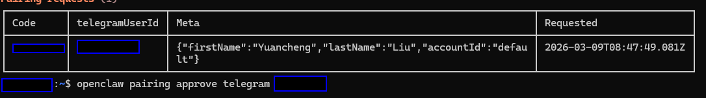
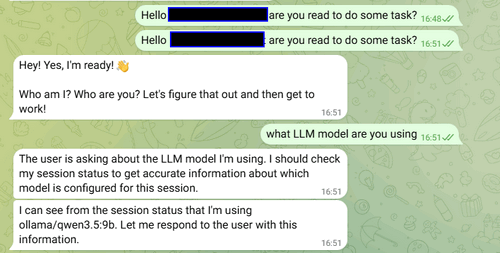
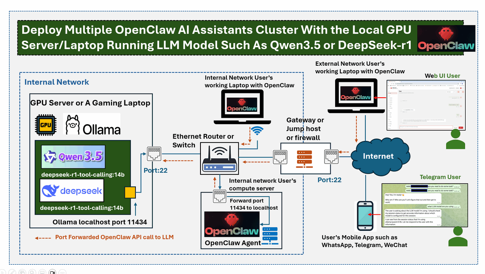

# Deploy Multiple OpenClaw AI Assistants Cluster With Local GPU Running Qwen3.5 or DeepSeek-r1

**Project Design Purpose** : In this article, I will share the design and deployment of a distributed multiple OpenClaw AI assistants cluster connected to one or two locally hosted Large Language Models (LLMs) running on one GPU-enabled server or gaming laptop. Instead of relying on using the cloud-based AI APIs. I used the open-source models such as `Qwen 3.5` or `DeepSeek-R1` to provide inference services for multiple OpenClaw agents, so we can reduces cloud AI token costs and compare the performance of different LLM models.

In this AI Assistant Cluster System, the GPU server acts as the centralized AI reasoning engine, and the distributed agents (computers run OpenClaw communicate with the LLM server over the network) execute tasks, collect system information, and interact with the model for decision-making. This article covers the following three sections:

- Setting up the open-source LLM model on a GPU server or gaming laptop/computer.
- Configuring and exposing the LLM inference service so that it can be accessed by remote OpenClaw nodes.
- Deploying OpenClaw agents on target computers or laptops and connecting them to the centralized LLM service.

```python
# Author:      Yuancheng Liu
# Created:     2026/03/10
# Version:     v_0.0.2
# Copyright:   Copyright (c) 2026 LiuYuancheng
# License:     MIT License
```

 **Table of Contents**

[TOC]

- [Deploy Multiple OpenClaw AI Assistants Cluster With Local GPU Running Qwen3.5 or DeepSeek-r1](#deploy-multiple-openclaw-ai-assistants-cluster-with-local-gpu-running-qwen35-or-deepseek-r1)
    + [1. Introduction](#1-introduction)
      - [1.1 Abstract and Background](#11-abstract-and-background)
      - [1.2 System Architecture](#12-system-architecture)
    + [2. Setting Up the OpenClaw Compatible Open-source LLM on GPU](#2-setting-up-the-openclaw-compatible-open-source-llm-on-gpu)
      - [2.1 Install Ollama on the GPU Server](#21-install-ollama-on-the-gpu-server)
      - [2.2 Pull OpenClaw Compatible Open-Source Models](#22-pull-openclaw-compatible-open-source-models)
      - [2.3 Downloading the LLM Model](#23-downloading-the-llm-model)
      - [2.4 Running the Model as a Background Service(optional)](#24-running-the-model-as-a-background-service-optional-)
    + [3. Forward the Ollama LLM Service to the User's Computer](#3-forward-the-ollama-llm-service-to-the-user-s-computer)
      - [3.1 Create an SSH Port Forwarding Tunnel](#31-create-an-ssh-port-forwarding-tunnel)
      - [3.3 Test the Ollama API Connection](#33-test-the-ollama-api-connection)
      - [3.4 Connecting Through a Jump Host (Optional)](#34-connecting-through-a-jump-host--optional-)
    + [4. Setup the OpenClaw on the User Computer](#4-setup-the-openclaw-on-the-user-computer)
      - [4.1 Install Dependence Node.js](#41-install-dependence-nodejs)
      - [4.2 Install OpenClaw AI Assistants](#42-install-openclaw-ai-assistants)
      - [4.3 Skip the OpenClaw Cloud Model Configuration](#43-skip-the-openclaw-cloud-model-configuration)
      - [4.4 Configure OpenClaw to Use the Local Ollama Model](#44-configure-openclaw-to-use-the-local-ollama-model)
      - [4.5 Optional: Integrating OpenClaw with Telegram](#45-optional--integrating-openclaw-with-telegram)
    + [5. Summery And Reference](#5-summery-and-reference)
      - [5.1 Summary](#51-summary)
      - [5.2 Reference](#52-reference)

------

### 1. Introduction

In this project, the design of "OpenClaw-cluster" separates LLM inference services from agent execution nodes. A GPU-enabled server or gaming laptop inside the internal network hosts the LLM models through `Ollama` framework, which provides a lightweight local API service for running open-source models. So multiple computers or laptops running OpenClaw agents connect to this centralized LLM service to perform reasoning and task execution.

#### 1.1 Abstract and Background 

Over the past month, the personal AI assistant [OpenClaw](https://openclaw.ai/) has rapidly become one of the most discussed open-source AI projects. Its rapid rise in popularity has led to a wave of new services and businesses around the ecosystem. For example in China, many individuals and organizations now offer installation/uninstallation services, remote deployment support, and children training courses on how to use OpenClaw effectively. Some companies even market “all-in-one OpenClaw machines/Laptop” preinstalled with OpenClaw and local large language models. And the major technology companies such as Tencent has also begun offering related OpenClaw deployment services: 


One of the key reasons behind the rapid adoption of OpenClaw is its "skills" based architecture, which enables the agent to call multiple tools and reasoning steps dynamically when executing tasks. While this design significantly enhances the intelligence and automation capability of the AI assistant, it also dramatically increases the number of LLM API calls. As a result, token consumption can be tens or even hundreds of times higher than that of traditional single-prompt AI agents. If you don't need to do complex tasks and have a GPU server or station such as Nvidia GB10 Spark or a gaming laptop with RTX-series 40-50XX graphics cards, you can link your OpenClaw to the open source LLM like `Qwen 3.5` or `DeepSeek‑R1` running on these local machine to save the costs especially when you have several OpenClaw Agents running on different device.

#### 1.2 System Architecture

The overall system follows a distributed agent + centralized inference architecture as shown below diagram. so it allows a single GPU server to support multiple OpenClaw agents simultaneously, forming a lightweight AI agent cluster while keeping hardware and cloud costs low.


The Architecture includes four layers:

- **LLM Host Layer** :  A GPU server or AI/gaming laptop hosts open-source LLM models through Ollama.
- **Network Access Layer** : Secure access is provided via SSH port forwarding through routers, gateways, or jump hosts.
- **Agent Layer** : Multiple OpenClaw agents run on user laptops or computers and send LLM requests through the forwarded port.
- **User Interaction Layer** : Users interact with the agents through their local system or messaging platforms such as mobile applications.

To improve security and avoid directly exposing the LLM service to the public network, the architecture uses SSH port forwarding. The Ollama inference service runs locally on port 11434, and this port is forwarded securely to authorized OpenClaw nodes through SSH (port 22). So with this approach:

- The LLM API is not exposed directly to the network.
- Only authenticated users with valid SSH accounts can access the model service
- External users can connect through a gateway, router, or jump host.
- Access control can be easily managed by enabling or disabling user accounts on the GPU server


------

### 2. Setting Up the OpenClaw Compatible Open-source LLM on GPU

All the configurations in this section should be performed on the **GPU server** that will host the Large Language Model (LLM). 

To run OpenClaw locally without relying on cloud APIs, we first need to deploy a compatible open-source LLM. One of the easiest ways to manage and run LLMs locally is by using **Ollama**, which provides a lightweight runtime for downloading, managing, and serving open-source LLMs with a simple command-line interface.

#### 2.1 Install Ollama on the GPU Server

To install Ollama on your GPU server. You can download it from the official page:https://ollama.com/download/linux

For most Linux systems, the installation can be completed using: 

```bash
curl -fsSL https://ollama.com/install.sh | sh
```

After installation, verify that the service is working and start the service : 

```bash
ollama --version
ollama serve
```

Ollama will expose a local API endpoint (localhost default port `11434`) that OpenClaw agents can later connect to.

#### 2.2 Pull OpenClaw Compatible Open-Source Models

OpenClaw supports multiple open-source LLMs as long as they provide tool-calling and reasoning capabilities. Through Ollama, users can easily deploy a variety of models depending on their available GPU resources.

Below is a reference table of commonly used models compatible with OpenClaw:

| **Model Name**       | **Parameter Size** | **Best Use Case**                        | **Context Window** | **Recommended Hardware**            |
| -------------------- | ------------------ | ---------------------------------------- | ------------------ | ----------------------------------- |
| **GLM-5**            | 744B (MoE)         | Complex debugging & multi-step coding    | 200K               | Enterprise (A100/H100) or Cloud API |
| **GPT-OSS-120B**     | 120B               | High-stakes reasoning & data privacy     | 128K               | Dual RTX 6000 / Mac Studio (Ultra)  |
| **DeepSeek-V3.2**    | 671B (MoE)         | General-purpose high-speed agentic tasks | 128K               | Cloud API / Multi-GPU Server        |
| **Kimi-K2.5**        | 1T (MoE)           | Vision + Text (multimodal agent tasks)   | 1M                 | Cloud API / 8x H100                 |
| **Qwen 3.5 (32B)**   | 32B                | Best balance for high-end consumer GPUs  | 128K               | RTX 4090 (24GB VRAM)                |
| **Llama 4 Maverick** | 70B                | Reliable daily assistant & tool calling  | 128K               | Mac Studio / Multi-RTX 3090         |
| **Qwen 3.5 (14B)**   | 14B                | Entry-level local agent tasks            | 64K                | RTX 3060/4070 (12GB+ VRAM)          |
| **MiMo-V2-Flash**    | ~30B (Active)      | Ultra-fast "thinking" & long research    | 256K               | RTX 4080/4090                       |

You can also browse compatible models directly from the Ollama model repository. On the Ollama website, check the Application tag to verify whether a model supports OpenClaw tool-calling functionality as shown below:


#### 2.3 Downloading the LLM Model

In this experiment, the GPU server is equipped with RTX 3060 and A5000 GPUs. Therefore, two models were selected:

- **Qwen3.5-35B-A3B-FP8** for high-quality reasoning
- **DeepSeek-R1-Tool-Calling-14B** for lightweight tool-calling tasks

Pull and run the Qwen3.5-35B-A3B-FP8 with below cmds:

```bash
ollama pull qwen3.5:35b
ollama run qwen3.5:35b
```

Pull and run the deepseek-r1-tool-calling:14b model with below cmds:

```bash
ollama pull MFDoom/deepseek-r1-tool-calling:14b
ollama run deepseek-r1-tool-calling:14b
```

Once the models are downloaded, Ollama will automatically load them when they are first called through the API.

#### 2.4 Running the Model as a Background Service(optional)

After installation, the Ollama service typically runs in the background. When an API request is sent to the Ollama endpoint, the required model will automatically be loaded into GPU memory. The first API request may take longer because the model must be initialized. To reduce this latency, you can configure the model to run as a persistent service.

On Linux systems, a simple systemd service can be created to keep the model loaded, as example is shown below:

```bash
[Unit]
Description=ollamaQwen35B_service
After=network.target
[Service]
ExecStart=ollama run qwen3.5:35b
WorkingDirectory=/home/<username>/ollama
User=root
Restart=always
RestartSec=5
StandardOutput=null
StandardError=null
[Install]
WantedBy=multi-user.target
```

Then copy the file `ollamaQwen35B_service.service` to the `/etc/systemd/system` director and start the service: 

```bash
sudo systemctl start ollamaQwen35B_service
```

After completing this step, the GPU server will host a locally running LLM inference service.


------

### 3. Forward the Ollama LLM Service to the User's Computer

All the configurations in this section should be performed on the computer or laptop where the OpenClaw agent will be installed.

Instead of exposing the Ollama API directly to the network (which may introduce security risks), we can use SSH port forwarding to securely tunnel the service to the local machine, so the OpenClaw agent running on a user’s laptop or workstation can interact with the LLM service as if it were running locally.

For security and access control, it is recommended to create a dedicated user account on the GPU server that will only be used for forwarding the LLM service traffic, for example I create a normal user `llmService` on the GPU. 

#### 3.1 Create an SSH Port Forwarding Tunnel

On the target computer or laptop where OpenClaw will run, execute the following SSH command to create a tunnel between the local machine and the GPU server.

If both machines are located in the same subnet or internal network, run:

```bash
ssh -L localhost:11434:localhost:11434 llmService@<GPU_Server_IP_Address>
```

This command creates a secure tunnel that maps:

```
Local Computer:   localhost:11434
        │
        │ (SSH Tunnel)
        ▼
GPU Server:       localhost:11434 (Ollama API)
```

#### 3.3 Test the Ollama API Connection

Once the SSH tunnel is established, you can verify the connection by sending a test request to the Ollama API.

Linux / macOS:

```bash
curl http://localhost:11434/api/chat -d "{\"model\":\"qwen3.5:9b\",\"messages\":[{\"role\":\"user\",\"content\":\"Hello!\"}]}"
```

Windows PowerShell:

```bash
curl.exe http://localhost:11434/api/chat -d '{"model":"qwen3.5:9b","messages":[{"role":"user","content":"Hello!"}]}'
```

If the connection is working correctly, the API will return a JSON response generated by the LLM model as shown below:


#### 3.4 Connecting Through a Jump Host (Optional)

In some environments, the GPU server may reside inside a restricted internal network and cannot be accessed directly from the user’s computer. In this case, a jump host (bastion server) can be used to relay the SSH connection.

On the target computer, run the following command:

```bash
ssh -L localhost:11434:localhost:11434 -J <jumphostUser>@<Jump_Host_IP> llmService@<GPU_Server_Ip_Address>
```

This creates the following connection path:

```
User Computer
      │
      ▼
Jump Host (SSH Gateway)
      │
      ▼
GPU Server (Ollama LLM Service)
```

Once the tunnel is established, the Ollama service will still be accessible locally via:

```html
http://localhost:11434
```


------

### 4. Setup the OpenClaw on the User Computer

All the configurations in this section should be performed on the computer or laptop where the OpenClaw agent will be installed.

#### 4.1 Install Dependence Node.js 

OpenClaw requires `Node.js` version 22 or above. Therefore, the first step is to install Node.js on the user computer/laptop. Download the installer from the official website: https://nodejs.org/en/download

Install the appropriate package based on your operating system (Windows, Linux, or macOS) and after installation verify that Node.js is correctly installed:

```bash
node -v
npm -v
```

#### 4.2 Install OpenClaw AI Assistants 

Next, install OpenClaw by following the official installation guide: https://docs.openclaw.ai/start/getting-started

For Linux, macOS, or WSL environments, the installation can be performed using the following command:

```bash
curl -fsSL https://openclaw.ai/install.sh | bash
```

#### 4.3 Skip the OpenClaw Cloud Model Configuration

During installation, OpenClaw will ask whether you want to configure model providers or external service integrations for the skills. As the deployment uses a locally hosted LLM via Ollama, these cloud-based configurations can be skipped. 

Example installation configuration:

```json
◇  Configure skills now? (recommended)
│  Yes
│
◇  Install missing skill dependencies
│  Skip for now
│
◇  Set GOOGLE_PLACES_API_KEY for goplaces?
│  No
│
◇  Set GEMINI_API_KEY for nano-banana-pro?
│  No
│
◇  Set NOTION_API_KEY for notion?
│  No
│
◇  Set OPENAI_API_KEY for openai-image-gen?
│  No
│
◇  Set OPENAI_API_KEY for openai-whisper-api?
│  No
│
◇  Set ELEVENLABS_API_KEY for sag?
│  No
```

Once the installation is complete, run the onboarding wizard:

```bash
openclaw onboard --install-daemon
```

#### 4.4 Configure OpenClaw to Use the Local Ollama Model

Next, modify the OpenClaw configuration file so that it uses the Ollama service forwarded from the GPU server.

Edit the configuration file:

```bash
~/.openclaw/openclaw.json
```

Add the Ollama provider configuration as shown below.

Note that the native Ollama API endpoint (`http://localhost:11434`) should be used instead of the OpenAI-compatible `/v1` endpoint. Example configuration (using the Qwen3.5 35B model):

```json
{
  "models": {
    "providers": {
      "ollama": {
        "baseUrl": "http://localhost:11434",
        "apiKey": "ollama-local",
        "api": "ollama-chat",
        "models": [
          {
            "id": "ollama/qwen3.5:35b",
            "name": "qwen3.5:35b",
            "reasoning": false,
            "input": ["text"],
            "cost": { "input": 0, "output": 0, "cacheRead": 0, "cacheWrite": 0 },
            "contextWindow": 128000,
            "maxTokens": 8000
          }
        ]
      }
    }
  },
  "agents": {
    "defaults": {
      "model": {
        "primary": "ollama/qwen3.5:35b"
      }
    }
  }
}
```

After saving the configuration file, restart the OpenClaw gateway service to apply the new settings:

```bash
openclaw gateway restart
```

To verify that OpenClaw can correctly access the Ollama model, run:

```
openclaw doctor --fix
# Or list all recognized models
openclaw models list
```

Then you can now launch the OpenClaw dashboard:

```
openclaw dashboard
```

The system will generate a dashboard URL containing an authentication token as shown below:

```
◇  How do you want to hatch your bot?
│  Open the Web UI
│
◇  Dashboard ready ────────────────────────────────────────────────────────────────╮
│                                                                                  │
│  Dashboard link (with token):                                                    │
│  http://127.0.0.1:18789/#token= <record your token in a file> │
│  Copy/paste this URL in a browser on this machine to control OpenClaw.           │
│  No GUI detected. Open from your computer:                                       │
│  ssh -N -L 18789:127.0.0.1:18789 xxxx@192.168.50.10                               │
│  Then open:                                                                      │
│  http://localhost:18789/                                                         │
│  http://localhost:18789/#token=<record your token in a file> │
│  Docs:                                                                           │
│  https://docs.openclaw.ai/gateway/remote                                         │
│  https://docs.openclaw.ai/web/control-ui  
```

Open this URL in your browser to access the OpenClaw web interface with the token:

```
http://127.0.0.1:18789/#token=<your_token>
```

If the OpenClaw host does not have a graphical interface, you can access the dashboard using SSH port forwarding:

```
ssh -N -L 18789:127.0.0.1:18789 <user>@<openclaw_host_ip>
```

Then open the following URL on your local computer: `http://localhost:18789` and you will see the OpenClaw dashboard page:



If the "health indicator" at the top of the dashboard shows green, the system is ready for use.

#### 4.5 Optional: Integrating OpenClaw with Telegram

To control OpenClaw remotely, you can integrate it with Telegram.

First, open Telegram and start a chat with `@BotFather` ,  Run `/newbot` (or `/mybots`)  and Copy the token (looks like 123456:ABC...)  as shown below:



Copy this token and add it to the OpenClaw configuration file `~/.openclaw/openclaw.json` as shown below:



After updating the configuration, send a message to the bot. Initially, the bot will not respond because the device must be paired. You will get the below access not configured example:



And in your OpenClaw server you will see your message is pending for approval as shown below:



To approve the connection, run the following commands on the OpenClaw host:

```bash
openclaw pairing list telegram
openclaw pairing approve telegram <YOUR_PAIRING_CODE>
```

After approving the pairing code, the Telegram bot will be able to communicate with your OpenClaw agent and assign tasks remotely. Then you can start to use the telegram to assign tasks to your OpenClaw as shown below:



After completing these steps, the OpenClaw agent running on the user’s computer will be connected to the GPU-hosted LLM service and can be controlled through the web dashboard or Telegram.

------

### 5. Summery And Reference

#### 5.1 Summary 



Implementing a distributed OpenClaw AI assistant cluster with locally hosted LLMs demonstrates a viable and cost‑effective alternative to cloud‑based AI services. By leveraging a GPU‑enabled server as a centralized inference engine and Ollama as the model runtime, multiple agent nodes can securely access powerful open‑source models like Qwen3.5‑35B or DeepSeek‑R1‑14B through SSH port forwarding—without exposing the service directly to the network.

This architecture not only eliminates recurring API token costs but also gives users full control over their data and model selection. The step‑by‑step guide shows that even consumer‑grade hardware (such as a gaming laptop with an RTX GPU) can support a small cluster of AI assistants, making advanced agent capabilities accessible to individuals and small teams. Integration with platforms like Telegram further extends the system's practicality, enabling remote task execution and interaction.

#### 5.2 Reference

- https://blog.csdn.net/u010026928/article/details/158582591

- https://www.nvidia.com/en-sg/products/workstations/dgx-spark/

- https://news.hubeidaily.net/pc/c_5240661.html

- https://www.pingwest.com/w/311980

- https://xueqiu.com/5680323216/377215813

- https://www.bilibili.com/video/BV1vdwczDEoR/?spm_id_from=333.1007.tianma.2-1-4.click&vd_source=5ff50dfdd1613df97004d3548592e433


------

>  last edit by LiuYuancheng (liu_yuan_cheng@hotmail.com) by 15/03/20256if you have any problem, please send me a message. 