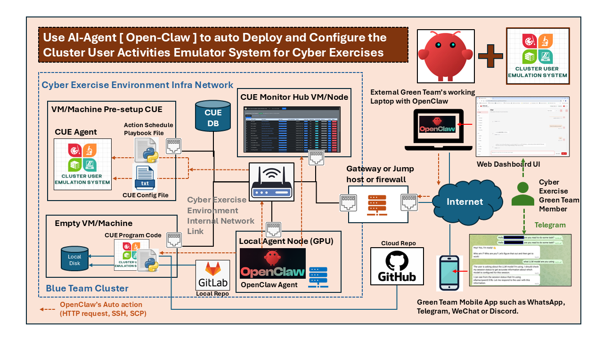
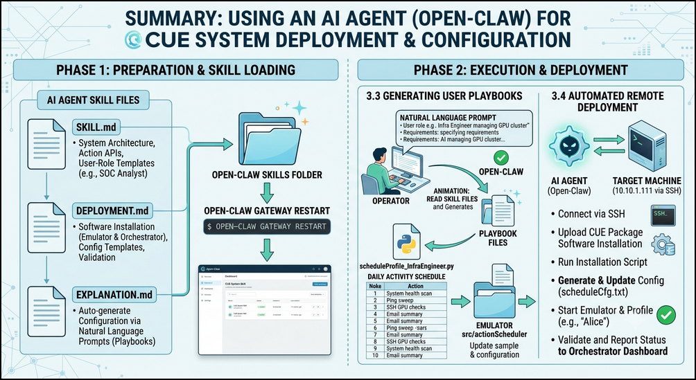
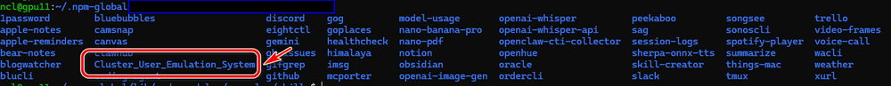
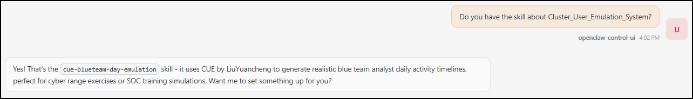
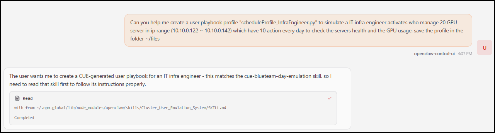
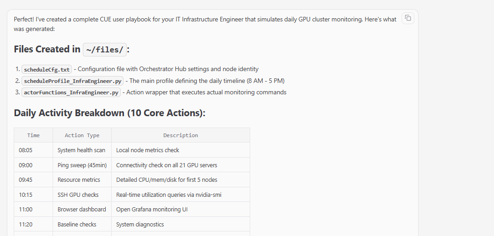
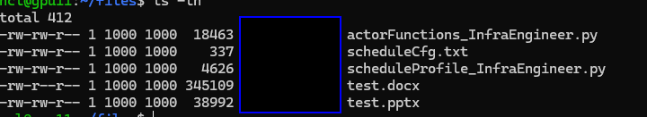

# Use Open-Claw to Deploy and Configure the Cluster User Activities Emulator for Cyber Exercises

In the previous article ["Cluster User Emulation System (CUE Agent) for Automated Blue Team and Red Team Activities in Cyber Exercises"](https://www.linkedin.com/pulse/cluster-user-emulation-system-cue-agent-auto-blue-team-yuancheng-liu-vngtc) ,  I introduced the **Cluster User Emulation System (CUE)** which is a framework can be used to automatically generate realistic Blue Team and Red Team user activities for cyber exercises. By emulating the daily behavior of legitimate users as well as attacker operations, the system helps create more realistic and dynamic cyber range environments while significantly reducing the manual effort required from exercise operators.



This article will introduce the details about how to use general-purpose AI agent (such as Open-Claw) to help the green team to configure and deploy the system in the cyber exercise. This article includes four main parts: 

- **Basic System Deployment** – Deploying the CUE system within a cyber exercise infrastructure, including the required components and network architecture.
- **System Execution Workflow** – Show the execution process after deployed in the infra includes the communication flow and interactions between the System Orchestrator and distributed CUE agents during operation.
- **AI-Assisted User Profile Generation** – Demonstrating how Open-Claw interprets API documentation to automatically generate realistic simulated user profiles and activity procedures.
- **AI-Assisted Remote Deployment** – Explaining how Open-Claw remotely installs, configures, and manages CUE agents on target machines, enabling large-scale automated deployment with minimal operator intervention.

```python
# Author:      Yuancheng Liu
# Created:     2026/07/16
# Version:     v_0.0.1
# Copyright:   Copyright (c) 2026 LiuYuancheng
# License:     GNU Lesser General Public License v3.0
```

**Table of Contents**

[TOC]

------

### 1. System Deployment

The **Cluster User Emulation (CUE) System** is designed with a distributed architecture that enables deployment across a wide range of computing environments, including a single workstation, multiple physical servers, virtual machines (VMs), Software Defined Network (SDN) environments, and lightweight IoT devices such as Raspberry Pi. This flexibility allows the system to emulate realistic user activities in cyber exercises ranging from small laboratory environments to large-scale enterprise cyber ranges.

The deployment network topology diagram is shown below:


The overall deployment process consists of the following steps:

1. Deploy the Activities Generation Modules Repository either centrally or locally on each emulator node.
2. Install the User Action Emulator package on every endpoint that will simulate user activities.
3. Configure each emulator with its execution profile, network settings, and Orchestrator connection parameters.
4. Deploy the Orchestrator Web Server to provide centralized scheduling, monitoring, and management.
5. Start the emulators, which register with the Orchestrator and begin executing the assigned user activity schedules.
6. Monitor task execution and emulator health through the Orchestrator's web-based management interface.

#### 1.1 Deploy Activities Modules Repository

The **Activities Generation Modules Repository** stores the reusable action modules that generate simulated user behaviors, including network traffic, application usage, human-computer interactions, and operating system operations. The repository can be deployed in one of two modes either in a file server or on one local VM/Node:

- **Centralized Repository** – Hosted on a database or file server that is accessible by all emulator nodes within the cluster.
- **Local Repository** – Installed on each emulator node, allowing the required activity modules to be imported locally without relying on network connectivity.

Supporting both deployment models provides greater flexibility for different cyber exercise environments while simplifying module updates and maintenance.

#### 1.2 Deploy User Action Emulator

The **User Action Emulator** is deployed on every endpoint that participates in the cyber exercise, including physical computers, virtual machines, cloud instances, or embedded devices. Each emulator executes scheduled user activities according to its assigned user profile while communicating with the Orchestrator to report execution status.

A typical emulator deployment package contains the following files:

| File                          | Description                                                  |
| ----------------------------- | ------------------------------------------------------------ |
| `setup.bat`                   | Installs the required software, Python runtime, libraries, and dependencies on the target machine. |
| `scheduleCfg.txt`             | Configuration file containing emulator parameters, such as the local repository path, Orchestrator IP address, authentication settings, logging configuration, and other runtime options. |
| `actorFunctions_<xxxxx>.py`   | Imports the required Activity Generation Modules and defines the functions used to execute simulated user activities. |
| `scheduleProfile_<xxxxxx>.py` | Defines the user activity schedule, including the timeline, execution sequence, event intervals, and scenario-specific behaviors. |

After deployment, each emulator automatically loads its configuration, imports the required activity modules, connects to the Orchestrator, and begins executing scheduled tasks according to the assigned simulation profile.

#### 1.3 Deploy Orchestrator Web Server

The **Orchestrator Web Server** provides centralized management and coordination for all deployed User Action Emulators. Depending on the cyber exercise infrastructure, the Orchestrator can be deployed either on a cloud server or within the internal cluster network. The Orchestrator is responsible for:

- Managing and distributing emulator configuration profiles.
- Coordinating task scheduling across multiple emulator nodes.
- Monitoring emulator health and execution status.
- Collecting activity logs and execution results.
- Providing a web-based dashboard for exercise operators to monitor and manage the entire emulation environment.

To reduce communication overhead and simplify network management, a **Monitoring Hub** can optionally be deployed within the cluster. The Monitoring Hub aggregates execution logs and status information from multiple emulators before forwarding them to the Orchestrator. Operators can access the monitoring dashboard through a standard web browser to observe emulator status, task progress, and overall system health in real time.


------

### 2. System Execution Workflow

After deployment, each **User Action Emulator** operates independently while remaining synchronized with the **Orchestrator**. The system workflow diagram is shown below:


The complete execution flow can be summarized as follows:

1. The **User Action Emulator** initializes its execution environment and loads the assigned user profile.
2. The **Data Manager** restores the previous execution state from the local database and establishes communication with the Orchestrator.
3. The **User Action Scheduler** starts three parallel Action Handlers to manage random, daily, and weekly activities.
4. When a scheduled event reaches its execution time, the corresponding Action Handler launches an independent Actor thread.
5. The Actor imports the required activity module from the Activities Generation Modules Repository and executes the simulated user action.
6. The **Actions Result Checker** verifies the execution result and collects runtime logs.
7. The **Data Manager** stores the execution history locally and periodically synchronizes the latest task status with the Orchestrator.
8. The **Monitor Node** and **Control Hub**, if deployed, display the execution progress and system health through their web-based management interfaces.

#### 2.1 Emulator Initialization

When the **User Action Emulator** starts, it first loads the local configuration files and initializes the execution environment. During initialization, the emulator creates several background threads that operate in parallel.

One of the first background services is the **Data Manager**, which retrieves the previous execution history from the local database. This allows the emulator to recover its execution state after an unexpected restart or system failure, preventing scheduled tasks from being executed repeatedly. At the same time, the Data Manager establishes communication with the Orchestrator and periodically uploads the emulator status, execution progress, and task history.

#### 2.2 Multi-threaded Task Scheduling

To emulate realistic user behavior, the scheduler divides activities into three independent execution queues that run concurrently:

- **Random Action Handler (Low Priority)** – Executes stochastic or condition-based activities, such as randomly opening applications, browsing websites, or performing background operations. These tasks are triggered only when predefined conditions are satisfied.
- **Daily Action Handler (Medium Priority)** – Manages timeline-based activities that represent a user's normal daily routine, such as logging into the operating system, checking emails, or launching productivity applications at scheduled times.
- **Weekly Action Handler (High Priority)** – Executes fixed events that must occur at specific times or on particular days, ensuring that critical scheduled activities always receive the highest execution priority.

#### 2.3 Actor Execution

When the User Action Scheduler detects that a scheduled task matches the current execution time, it forwards the task to the appropriate Action Handler.

Instead of executing the activity directly, the handler creates a dedicated Actor thread. The Actor dynamically imports the required module from the Activities Generation Modules Repository and executes the corresponding user action. Depending on the activity type, the Actor may generate network traffic, simulate keyboard and mouse interactions, launch desktop applications, execute operating system commands, or perform other predefined behaviors.

#### 2.4 Result Collection and State Management

After an Actor completes its assigned task, the execution result is forwarded to the **Actions Result Checker**, which verifies the execution outcome and collects runtime information, including execution logs, status messages, and error information.

The verified results are then passed to the **Data Manager**, which stores the execution records in the local database together with the current task progress. These records enable the emulator to recover its execution state after a restart and provide historical information for later analysis.


------

### 3. Using an AI Agent to Deploy and Configure the CUE System

To simplify the user profile creation and CUE deployment process, I create a collection of AI Agent Skill Files that general-purpose AI agents such as **Open-Claw** can use them to understand the CUE architecture, generate customized user activity playbooks, and automate software deployment across multiple machines. The following sections will demonstrate how Open-Claw can automatically generate simulation profiles and deploy the User Action Emulator. The main work flow is shown below: 



#### 3.1 AI Agent Skill File Detail

The CUE project provides three complementary skill files that extend the AI agent with knowledge about the system architecture, deployment procedures, and configuration generation.

**3.1.1 SKILL.md**

- Purpose :  The main entry point for the AI agent explains when the skill should be activated, introduces the available Action APIs grouped by functionality, and provides several predefined user-role templates such as SOC Analyst, Network Administrator, Incident Responder, OT/ICS Engineer, and Helpdesk Operator.
- Function : Introduce the CUE architecture to the AI agent, describe available Action APIs and Provide common user-role templates.
- Agent Skill File: https://github.com/LiuYuancheng/Cluster_User_Emulation_System/blob/main/src/AI_Agent/SKILL.md

**3.1.2 DEPLOYMENT.md**

- Purpose :  Teaches the AI agent how to deploy the CUE software on both emulator nodes and the centralized Orchestrator server with installation procedures, configuration templates, validation steps and troubleshooting guidelines.
- Function : Install User Action Emulator nodes, Deploy the Orchestrator and Monitor Hub, Generate `scheduleCfg.txt`, Validate deployment and Troubleshoot common deployment problems.
- Agent Skill File: https://github.com/LiuYuancheng/Cluster_User_Emulation_System/blob/main/src/AI_Agent/DEPLOYMENT.md

**3.1.3 EXPLANATION.md**

- Purpose : Guide the AI agent automatically generating customized simulation configuration files based on natural language descriptions.
- Function : Given a user's job role, working schedule, network environment, and activity requirements, the AI agent can generate all required CUE playbook files without requiring the operator to manually edit Python code.
- Agent Skill File: https://github.com/LiuYuancheng/Cluster_User_Emulation_System/blob/main/src/AI_Agent/EXPLANATION.md

#### 3.2 Loading the Skill Files into Open-Claw

Now we use the Open-Claw as an example to show how to use AI agent to help do the deploy and setup work.

First, create a new folder named **Cluster_User_Emulation_System** inside the Open-Claw skills directory and copy the three skill files into it, as illustrated below.



After copying the files, restart the Open-Claw Gateway to reload the newly installed skills.

```
openclaw gateway restart
```

For older versions of Open-Claw, the custom skill directory may also need to be added manually to the configuration file: `~/.openclaw/openclaw.json`

Once Open-Claw has restarted, open the dashboard and verify that the **Cluster User Emulation System** skill has been successfully loaded as shown below:




#### 3.3 Generating a User Activity Playbook

After installing the skill files, the AI agent can generate customized user activity playbooks using natural language prompts.

The operator simply describes the simulated user's role together with several high-level requirements, including:`User role`, `Daily responsibilities`, `Number of scheduled activities`, `Whether to generate random background activities` and `Output directory`. 

For example, the following prompt requests a playbook for an IT infrastructure engineer responsible for managing a GPU cluster.

```
Can you help me create a user playbook profile "scheduleProfile_InfraEngineer.py" to simulate an IT infrastructure engineer who manages 20 GPU servers in the IP range 10.10.0.122 ~ 10.10.0.142.

The engineer should perform 10 activities every day to check server health and GPU utilization.Save the generated files into ~/files.
```

Then you can see that the Open-Claw can start to read the skill and implement the profile and playbook:



Once the generation process completes, the AI agent produces three playbook files together with a realistic daily activity schedule as shown below : 



With the 10 actions which a GPU IT infra manage engineer may do during his daily work:

| Time        | Action Type        | Description                                        |
| ----------- | ------------------ | -------------------------------------------------- |
| 08:05       | System health scan | Local node metrics check                           |
| 09:00       | Ping sweep (45min) | Connectivity check on all 21 GPU servers           |
| 09:45       | Resource metrics   | Detailed CPU/mem/disk for first 5 nodes            |
| 10:15       | SSH GPU checks     | Real-time utilization queries via nvidia-smi       |
| 11:00       | Browser dashboard  | Open Grafana monitoring UI                         |
| 11:20       | Baseline checks    | System diagnostics                                 |
| 12:00-12:30 | Lunch break        | Human filler (local tool launch + typing activity) |
| 13:00       | SSH batch checks   | Remaining servers (gpu-node-006 to -021)           |
| 14:30       | Port audit         | Network service scan on cluster                    |
| 15:00+      | End-of-day wrapup  | System diagnostics, config backups, email summary  |

After generation, copy the three generated files into the emulator's `src/actionScheduler` directory.



Next, update the emulator configuration by modifying the Monitor Hub address and the assigned profile inside `scheduleCfg.txt`.

```
Own_ID = "InfraEngineer_001"
OWN_IP = "10.10.0.122" # Engineer's node IP (one of the GPU servers used as admin workstation)
HOST_PORT = 3001
RPT_MD = True
HUB_IP = "10.10.0.1" # Orchestrator hub IP (lab network address)
HUB_PORT = 5000
PROFILE = "scheduleProfile_InfraEngineer.py"
```

Then restart the User Action Emulator. The new profile is automatically loaded, and the Orchestrator dashboard immediately begins displaying the execution status of the simulated Infrastructure Engineer.


#### 3.4 Deploying the User Action Emulator with an AI Agent

Besides generating simulation profiles, Open-Claw can also automate the installation and validation of the User Action Emulator on remote machines.

To perform a deployment, the AI agent requires SSH access to the target system. Once valid credentials are provided, it can remotely connect to the host, install the required software packages, copy the emulator files, configure the execution profile, and perform a post-installation verification.

An example prompt is shown below.

```
Setup CUE in the target machine 10.10.1.111 via ssh 
ssh user name : xxxxx
ssh password: xxxxx
After the installation is complete,run the profile Alice and verify that no execution errors are reported.
```

Using the deployment knowledge defined in **DEPLOYMENT.md**, Open-Claw performs the following tasks automatically:

1. Connects to the target machine using SSH.
2. Uploads the CUE installation package.
3. Executes the installation script (`setup.bat` or equivalent).
4. Generates and updates the `scheduleCfg.txt` configuration file.
5. Copies the generated playbook files to the appropriate directory.
6. Starts the User Action Emulator.
7. Executes the specified user profile.
8. Validates that the emulator starts successfully and reports its status to the Orchestrator.

### 4. Conclusion


The integration of Open-Claw with the CUE system represents a powerful step forward in the automation of cyber range management. By leveraging AI-generated skill files, operators can rapidly move from a high-level description of a user's role to a fully deployed, executing simulation. This workflow not only reduces the barrier to entry for complex cyber exercises but also provides a scalable framework for future automation. The ability to dynamically generate and deploy "digital personas" using conversational prompts transforms the CUE from a powerful tool into an agile and intelligent asset for any security training program.

------

> Last edit by LiuYuancheng (liu_yuan_cheng@hotmail.com) at 15/07/2026, if you have any problem or find anu bug, please send me a message .