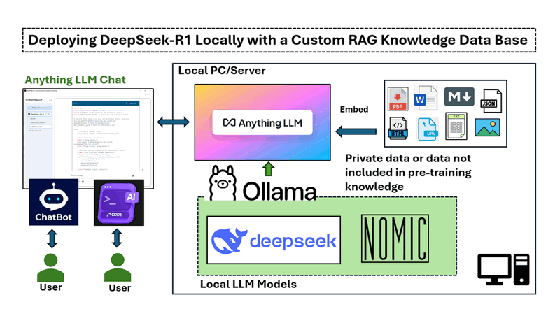
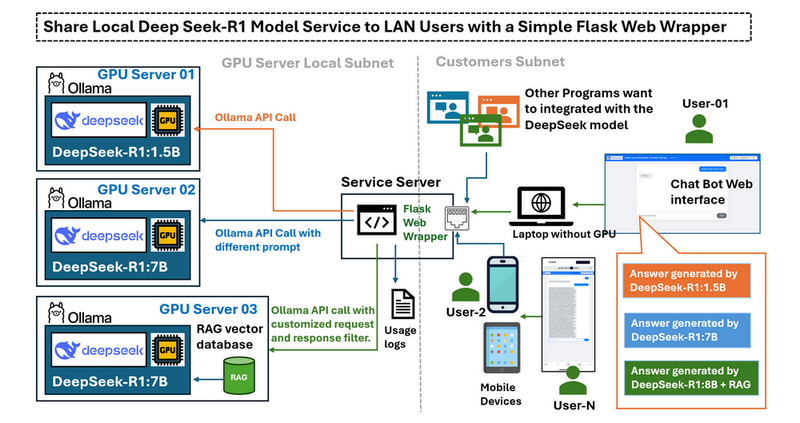
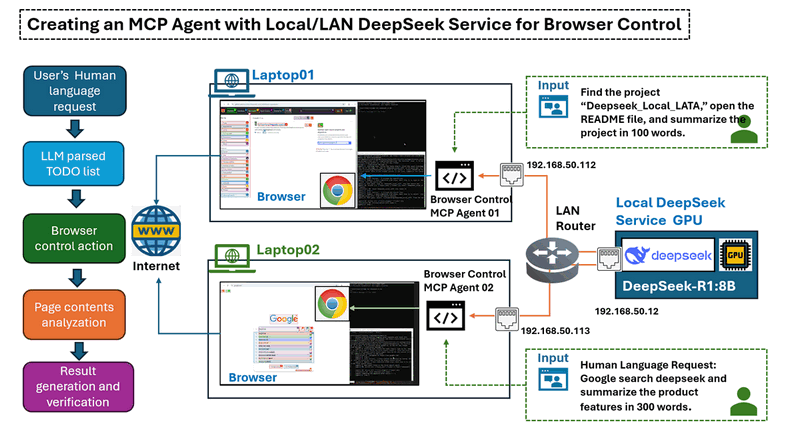
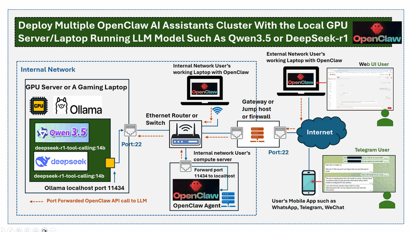
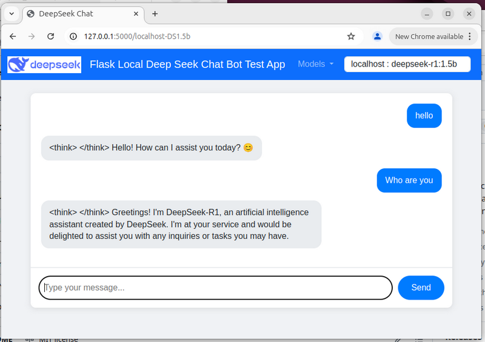

# Deepseek_Local_LATA_Repo
**Project Design Purpose** : A repo includes (L)earning, (A)rticles, (T)esting and (A)pplication program with setting the DeepSeek LLM locally. The project contents four  main parts of contents: 

- **Learning (L):** A curated collection of learning resources, including books, programming examples, relevant links, and videos to help users understand and work with DeepSeek models.
- **Articles (A):** Step-by-step guides, tutorials, and technical write-ups covering installation, configuration, testing, and real-world usage of DeepSeek models.
- **Testing (T):** A suite of simple test programs aimed at exploring different technologies, such as prompt engineering and retrieval-augmented generation (RAG) with DeepSeek.
- **Application (A):** Practical source code implementations demonstrating how DeepSeek can be integrated into real-world applications to assist users in various tasks.

```python
# Author:      Yuancheng Liu
# Created:     2025/02/23
# version:     v_0.0.5
# Copyright:   Copyright (c) 2025 LiuYuancheng
# License:     MIT License
```

**Table of Contents** 

[TOC]

- [Deepseek_Local_LATA_Repo](#deepseek-local-lata-repo)
    + [1. Introduction](#1-introduction)
    + [2. AI Projects Overview](#2-ai-projects-overview)
      - [2.1 Deploying DeepSeek-R1 Locally with a Custom RAG Knowledge Data Base](#21-deploying-deepseek-r1-locally-with-a-custom-rag-knowledge-data-base)
      - [2.2 Use a Simple Web Wrapper to Share the Local Deep Seek-R1 Model Service to LAN Users](#22-use-a-simple-web-wrapper-to-share-the-local-deep-seek-r1-model-service-to-lan-users)
      - [2.3 MCP Agent with Local/LAN DeepSeek Service for Browser Control](#23-mcp-agent-with-local-lan-deepseek-service-for-browser-control)
      - [2.4 Deploy Multiple OpenClaw AI Assistants Cluster With Local GPU Running Qwen3.5 or DeepSeek-r1](#24-deploy-multiple-openclaw-ai-assistants-cluster-with-local-gpu-running-qwen35-or-deepseek-r1)
    + [3. Application and Program](#3-application-and-program)
      - [3.1 Flask Local Deep Seek Chat Bot Test App](#31-flask-local-deep-seek-chat-bot-test-app)

------

### 1. Introduction

This project is a article and program set for learning and using the DeepSeek LLM for building the Agents or Skills. The main components includes: 

- **Application** :  the simple program and application use or link to the LLM such as AI agent or AI Assistants. 
- **Articles**: The Articles for using and testing LLM or building the application. 
- **Learning Material**: The material or resources for learning or cases using the LLM. 
- **Testing** : Testing result or testing data set for the LLM.


------

### 2. AI Projects Overview

This section will give a quick overview of the AI project I created or working on. 

#### 2.1 Deploying DeepSeek-R1 Locally with a Custom RAG Knowledge Data Base

This Project is to explore how to deploy DeepSeek-R1 an open-source large language model (LLM), and integrate it with a customized Retrieval-Augmented Generation (RAG) knowledge base on your local machine (PC/server). The program workflow diagram is shown below:



This setup enables the model to utilize domain-specific knowledge for expert-level responses while maintaining data privacy and customization flexibility. By doing so, users can enhance the model’s expertise in specific technical domains, enabling applications such as AI-powered support chatbots, private code generation, and industry-specific assistants. Most importantly, this setup allows users to keep proprietary data private, ensuring sensitive documents, licensed software, or non-public information remain secure while still benefiting from AI-powered insights.

> - Article Link: https://www.linkedin.com/pulse/deploying-deepseek-r1-locally-custom-rag-knowledge-data-yuancheng-liu-uzxwc
> - Project Link : [Jump to the project folder](Articles/1_LocalDeepSeekWithRAG)


#### 2.2 Use a Simple Web Wrapper to Share the Local Deep Seek-R1 Model Service to LAN Users

This project will provide a flask wrapper program, explores practical use case scenarios, and explains how to configure Ollama to expose the service for LLM API calls. We will explore how a simple Python-Flask-based web wrapper acts as a controlled “bridge” between the local LLM service (deepseek-r1) and LAN users. The system work flow diagram is shown below:



The application provide below feature or functions:

- Limits access to only the necessary functions (e.g., sending questions and receiving responses).
- Provides an intuitive web-based interface for mobile devices.
- Enables programmatic API calls with controlled access.
- Acts as a central hub for connecting to multiple GPU servers and different DeepSeek LLM versions.

> - Article Link: https://www.linkedin.com/pulse/use-simple-web-wrapper-share-local-deep-seek-r1-model-yuancheng-liu-n7p6c
> - Project Link :  [Jump to the project folder](Articles/2_ShareLocalDeepSeekService)

#### 2.3 MCP Agent with Local/LAN DeepSeek Service for Browser Control

The project is aimed to create a AI-driven Model Context Protocol (MCP) Agent that can help user to operate a web browser to complete tasks or generate network traffic based on human language instructions. This is achieved using the powerful [browser-use](https://github.com/browser-use/browser-use) library in combination with a Local/LAN configured DeepSeek LLM module service. The system workflow diagram is shown below:



> -  Article Link: https://www.linkedin.com/pulse/creating-mcp-agent-locallan-deepseek-service-browser-control-liu-ebghc
>
> - Project Link : [Jump to the project folder](Application/BrowserAgent)

#### 2.4 Deploy Multiple OpenClaw AI Assistants Cluster With Local GPU Running Qwen3.5 or DeepSeek-r1

This project a distributed multiple OpenClaw AI assistants cluster connected to one or two locally hosted Large Language Models (LLMs) running on one GPU-enabled server or gaming laptop. Instead of relying on using the cloud-based AI APIs. I used the open-source models such as Qwen 3.5 or DeepSeek-R1 to provide inference services for multiple OpenClaw agents, so we can reduces cloud AI token costs and compare the performance of different LLM models.



> - Article: https://www.linkedin.com/pulse/deploy-multiple-openclaw-ai-assistants-cluster-local-gpu-liu-kcy2c
> - Project Link : [Jump to the project folder](Articles/5_OpenclawWithDeepSeek)


------

### 3. Application and Program 

This section will introduce the program and applications 

#### 3.1 Flask Local Deep Seek Chat Bot Test App

This application provides a user-friendly interface for remote access to multiple LLM models running on different GPUs ( using the Ollama host the model). The chatbot is designed for the following purposes:

- Testing the functionality of GPU-hosted Ollama LLM instances.
- Allowing shared access to specialized LLMs (fine-tuned or RAG embedded) without requiring direct SSH access.
- Comparing the performance of different LLM models, such as DeepSeek R1-1.5B and DeepSeek R1-7B, in response to the same query.



>  Project Link : [Jump to the project folder](Testing/1_Simple_Flask_Deepseek_ChatBot)


------

> last edit by LiuYuancheng (liu_yuan_cheng@hotmail.com) by 17/03/2026 if you have any question , please send me a message. 