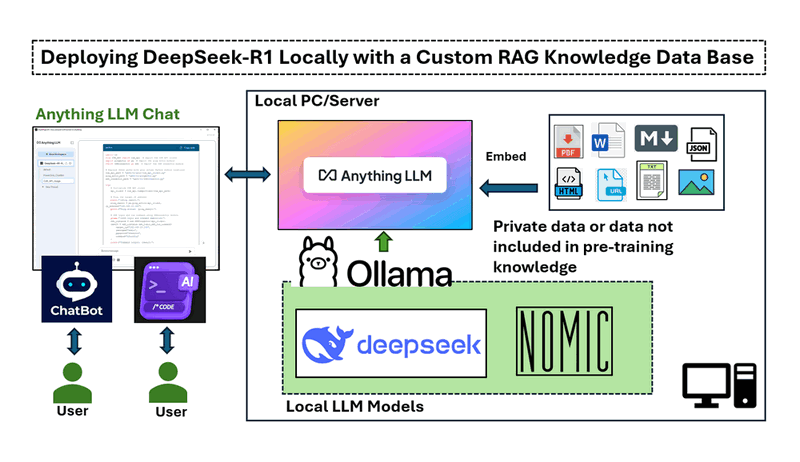

# Deepseek_Local_LATA
**Project Design Purpose** : A repo includes (L)earning, (A)rticles, (T)esting and (A)pplication program with setting the DeepSeek LLM locally. The report contents four  main parts of contents: 

- **Learning (L):** A curated collection of learning resources, including books, programming examples, relevant links, and videos to help users understand and work with DeepSeek models.
- **Articles (A):** Step-by-step guides, tutorials, and technical write-ups covering installation, configuration, testing, and real-world usage of DeepSeek models.
- **Testing (T):** A suite of simple test programs aimed at exploring different technologies, such as prompt engineering and retrieval-augmented generation (RAG) with DeepSeek.
- **Application (A):** Practical source code implementations demonstrating how DeepSeek can be integrated into real-world applications to assist users in various tasks.

```
# Author:      Yuancheng Liu
# Created:     2025/02/23
# version:     v_0.0.1
# Copyright:   Copyright (c) 2025 LiuYuancheng
# License:     MIT License
```

[TOC]


------

### Introduction

- [ ] Under Editing

#### Deploying DeepSeek-R1 Locally with a Custom RAG Knowledge Data Base

This article is to explore how to deploy DeepSeek-R1 an open-source large language model (LLM), and integrate it with a customized Retrieval-Augmented Generation (RAG) knowledge base on your local machine (PC/server). 



This setup enables the model to utilize domain-specific knowledge for expert-level responses while maintaining data privacy and customization flexibility. By doing so, users can enhance the model’s expertise in specific technical domains, enabling applications such as AI-powered support chatbots, private code generation, and industry-specific assistants. Most importantly, this setup allows users to keep proprietary data private, ensuring sensitive documents, licensed software, or non-public information remain secure while still benefiting from AI-powered insights.

Project Link : [Jump to the project folder](Articles/1_LocalDeepSeekWithRAG)


#### Flask Local Deep Seek Chat Bot Test App

This application provides a user-friendly interface for remote access to multiple LLM models running on different GPUs ( using the Ollama host the model). The chatbot is designed for the following purposes:

- Testing the functionality of GPU-hosted Ollama LLM instances.
- Allowing shared access to specialized LLMs (fine-tuned or RAG embedded) without requiring direct SSH access.
- Comparing the performance of different LLM models, such as DeepSeek R1-1.5B and DeepSeek R1-7B, in response to the same query.


Project Link : [Jump to the project folder](Testing/1_Simple_Flask_Deepseek_ChatBot)

------

> last edit by LiuYuancheng (liu_yuan_cheng@hotmail.com) by 28/02/2025 if you have any question , please send me a message. 