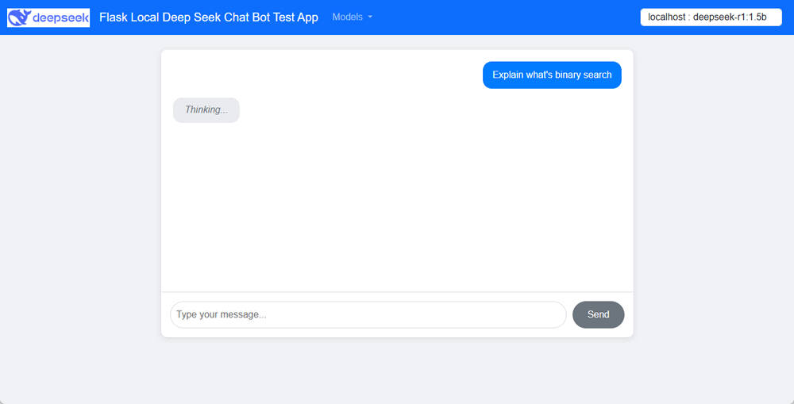
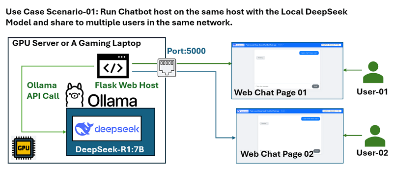
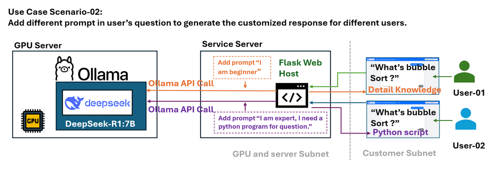
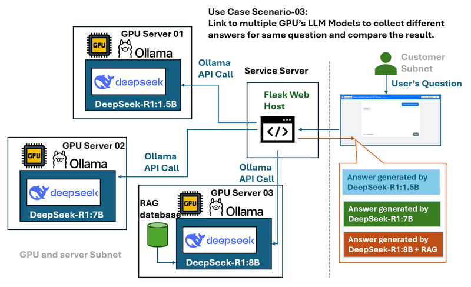
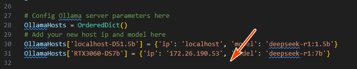
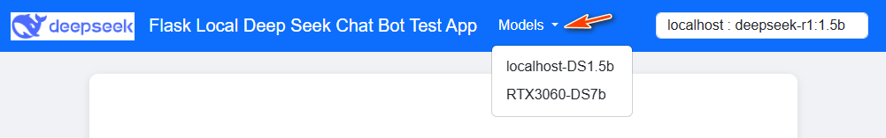
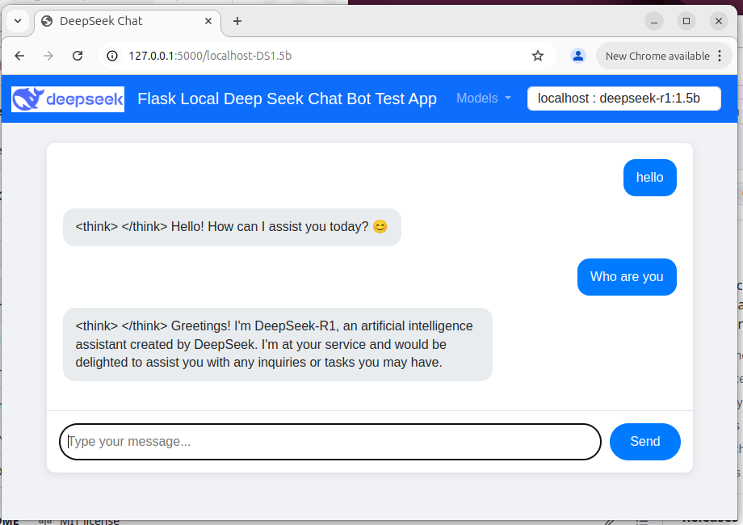

# Flask Local Deep Seek Chat Bot Test App

**Project Design Purpose** : The Flask Local Deep Seek Chat Bot Test App is designed to create a simple python-flask-based chatbot that can connect to multiple local GPU servers within the same subnet for filling below four requirements :

- Connect multiple local GPU servers running different DeepSeek LLM versions within a subnet.
- Enable remote testing and performance comparison of LLM responses.
- Provide controlled access to specialized/fine-tuned models without exposing server credentials.
- Facilitate prompt engineering by modifying user queries before model submission.

```
# Created:     2025/02/23
# version:     v_0.0.1
# Copyright:   Copyright (c) 2025 LiuYuancheng
# License:     MIT License
```

**Table of Contents**

[TOC]

- [Flask Local Deep Seek Chat Bot Test App](#flask-local-deep-seek-chat-bot-test-app)
    + [Introduction](#introduction)
    + [Program Design](#program-design)
    + [Program Setup](#program-setup)
    + [Program Usage](#program-usage)

------

### Introduction

This application provides a user-friendly interface for remote access to multiple LLM models running on different GPUs ( using the Ollama host the model). The chatbot is designed for the following purposes:

- Testing the functionality of GPU-hosted Ollama LLM instances.
- Allowing shared access to specialized LLMs (fine-tuned or RAG embedded) without requiring direct SSH access.
- Comparing the performance of different LLM models, such as DeepSeek R1-1.5B and DeepSeek R1-7B, in response to the same query.

The chat bot web UI is shown below :



Users can interact with the chatbot via a web-based UI that includes a model selection dropdown in the navigation bar.


------

### Program Design

The chatbot utilizes the Ollama API and is designed for three primary scenarios:

**Scenario 01 : Remote Access Without SSH Credentials**

For GPU servers running DeepSeek on an Ubuntu server without a desktop environment (which is difficult for the user to use the Desktop application tool such as anything LLM and the LM-studio), this chatbot allows external users to query the model without needing SSH access. The chatbot web host runs on the server and exposes port 5000 for multiple users within the same network.

The scenario workflow diagram is shown below :



**Scenario 02: Customized System Prompts**

The application allow the admin to modify user queries by appending relevant prompt context before send to the LLM. For example, user ask LLM to explain what is bubble sort algo, based on different users, the program can add the prompt to change the question to :

- A beginner query: "I am new to sorting algorithms. What is bubble sort?"
- An advanced query: "I am an expert and need a Python example. What is bubble sort?"

This allows for more tailored responses based on user expertise.

The scenario workflow diagram is shown below :



**Scenario 03: Multi-GPU Model Comparison**

For environments with multiple GPU servers running different LLM models (e.g., DeepSeek R1-1.5B, DeepSeek R1-7B, DeepSeek Coder V2), the chatbot serves as a bridge between users and these models. Users can compare responses from different models via a centralized UI. The scenario workflow diagram is shown below :



 

------

### Program Setup

**Development Environment** : python 3.7.4rc2+ 64bit [ Windows11 ]

**Additional Lib/Software Need** 

| Lib Module   | Version | Installation           | Lib link                           |
| ------------ | ------- | ---------------------- | ---------------------------------- |
| **Flask**    | 1.1.2   | `pip install Flask`    | https://pypi.org/project/Flask/    |
| **requests** | 2.28.1  | `pip install requests` | https://pypi.org/project/requests/ |

**Program Source File List** 

| Program File               | Execution Env | Module Description                  |
| -------------------------- | ------------- | ----------------------------------- |
| `src/app.py`               | python 3      | Main web host program.              |
| `src/`requestTest.py`      | python 3      | Web API request test program.       |
| `src/templates/index.html` | html          | Main chat bot web page.             |
| `src/static/script.js`     | JavaScript    | JS to update the conversation area. |
| `src/static/style.css`     | CSS           | css file.                           |


------

### Program Usage

**Step 1: Add LLM Ollama Servers to the Program**

Modify `app.py` to append server details with a unique ID:

```
OllamaHosts[<unique_ID>] = {'ip': <host IP address>, 'model': <llm model name>}
```




**Step 2: Start the Chatbot Web Host**

Execute the following command to start the chatbot:

```
python app.py
```

Access the web UI at `http://127.0.0.1:5000/` and select the desired model from the dropdown menu.




**Step 3: Test the Chatbot via Web UI and API Calls**

- **Web Interface** : Users can input queries directly into the chatbot interface and receive responses.



- **API Request** : For program usage, use python request lib to send a http `GET` request to get response: 

```
requests.get("http://127.0.0.1:5000/getResp", json={'model':'localhost-DS1.5b', 'message':"who are you"})
```

Alternatively, refer to `requestTest.py` for more API usage examples.

------

> last edit by LiuYuancheng (liu_yuan_cheng@hotmail.com) by 28/02/2025 if you have any question , please send me a message. 