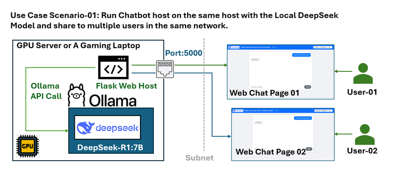

# Flask Local Deep Seek Chat Bot Test App

**Project Design Purpose**:  We want to create a simple flask App Chat Bot  which can link to multiple local GPU servers ( in one subnet) which running different version of deep seek and test and compare the response of different version of LLM model.

```
# Created:     2025/02/23
# version:     v_0.0.1
# Copyright:   Copyright (c) 2025 LiuYuancheng
# License:     MIT License
```

[TOC]

------

### Introduction

The Flask Local Deep Seek Chat Bot Test App is a simple test program which provide the selection function for use to remote access (as questions) to multiple LLM models running on different GPU with the Ollama host. The programming can be used for: 

- Test whether a GPU host Ollama LLM works.
- Share the special LLM (finetuned or RAG embedded) to others to let them remote use (Ask questions )
- Compare the performance of different LLM's response of one question such as deepseekR1-1.5b, DeepseekR1-7b. 

The chat bot UI is shown below:


The user can select the models in the navigation bar's drop down menu. 


------

### System Design

The test program is designed for below scenarios:

**Scenario 01**: 

Assume you have one GPU server which running deepseek locally with the Ubuntu server version OS (without the desktop), you want to some people use the model but you don't want to tell them the ssh log password and you want to limited the Ollama API people can use. 

You can run the chatbot web host on the server and expose port 5000 for multiple users in the same network, then they or their program can send questions and get the answer as shown below:



**Scenario 02**:

You want to add customized system prompt or background information with the user's question, or we want to add a prompt to improve the detail level of the response. Such as when people ask "What is bubble sort?" For 0 knowledge student we want to change the question to "I am beginner to learn sort algo, what is bubble sort". For the people who have knowledge, we want to change the question to "I am expert and I want a python example, what is bubble sort?", then in the web host program we can append the related prompt in user's question based on our requirement. 


 

